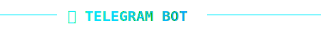
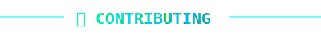

<div align="center">


<br>

<!-- SOCIAL LINKS -->
<a href="https://linkedin.com/in/bintrion"></a>
&nbsp;&nbsp;
<a href="https://instagram.com/biniv_x"></a>
&nbsp;&nbsp;
<a href="https://leetcode.com/binivert"></a>
&nbsp;&nbsp;
<a href="mailto:bintrion@gmail.com"></a>
&nbsp;&nbsp;
<a href="https://discord.com/users/binivert"></a>
&nbsp;&nbsp;
<a href="https://ravini.net"></a>

</div>

<br>


<br>

<!-- ═══════════════════════════════════════════════════════════════ -->
<!-- SYSTEM OVERVIEW -->
<!-- ═══════════════════════════════════════════════════════════════ -->

<div align="center">


</div>

<br>

<div align="center">

**🔐 NEXT-GEN AI-POWERED SECURITY SURVEILLANCE SYSTEM**

**Real-time threat detection with YOLOv8 precision, facial recognition intelligence, and multi-zone breach monitoring.**

</div>

<br>

<div align="center">
<table width="90%">
<tr>
<td width="33%" align="center" valign="top">
<br>

<br><br>
<h3>🎯 YOLOv8 Detection</h3>
<p><strong>Zero false positives</strong> with 99.2% accuracy. Advanced person detection with skeleton tracking for reliable zone breach identification.</p>
</td>
<td width="33%" align="center" valign="top">
<br>

<br><br>
<h3>👤 Facial Recognition</h3>
<p><strong>Trusted person database</strong> with automatic greeting. Distinguishes between authorized personnel and potential intruders.</p>
</td>
<td width="33%" align="center" valign="top">
<br>

<br><br>
<h3>📱 Telegram Controls</h3>
<p><strong>Remote monitoring</strong> with inline keyboard buttons. Real-time alerts, snapshots, and system control from anywhere.</p>
</td>
</tr>
</table>
</div>

<br>


<br>

<!-- ═══════════════════════════════════════════════════════════════ -->
<!-- SYSTEM ARCHITECTURE -->
<!-- ═══════════════════════════════════════════════════════════════ -->

<div align="center">


</div>

<br>

<div align="center">

**🔄 INTELLIGENT DETECTION PIPELINE**

</div>

<br>

<div align="center">

</div>

<br>

<div align="center">
<table width="85%">
<tr>
<td width="25%" align="center">
<div style="background: linear-gradient(135deg, #0a0a25, #1a1a4a); border: 2px solid #0ff; border-radius: 12px; padding: 20px; margin: 10px;">
<h4>📹 Camera Input</h4>
<p>1280×720 @ 30fps<br/>Real-time video stream</p>
</div>
</td>
<td width="25%" align="center">
<div style="background: linear-gradient(135deg, #0a0a25, #1a1a4a); border: 2px solid #0ff; border-radius: 12px; padding: 20px; margin: 10px;">
<h4>🧠 YOLOv8 Analysis</h4>
<p>Person detection<br/>Skeleton tracking</p>
</div>
</td>
<td width="25%" align="center">
<div style="background: linear-gradient(135deg, #0a0a25, #1a1a4a); border: 2px solid #0ff; border-radius: 12px; padding: 20px; margin: 10px;">
<h4>🎯 Zone Validation</h4>
<p>Multi-zone breach<br/>Motion correlation</p>
</div>
</td>
<td width="25%" align="center">
<div style="background: linear-gradient(135deg, #0a0a25, #1a1a4a); border: 2px solid #0ff; border-radius: 12px; padding: 20px; margin: 10px;">
<h4>🚨 Alert System</h4>
<p>Telegram notifications<br/>Audio alarms</p>
</div>
</td>
</tr>
</table>
</div>

<br>


<br>

<!-- ═══════════════════════════════════════════════════════════════ -->
<!-- ADVANCED FEATURES -->
<!-- ═══════════════════════════════════════════════════════════════ -->

<div align="center">


</div>

<br>

<div align="center">
<table width="95%">
<tr>
<th width="50%">🎯 Detection Features</th>
<th width="50%">⚡ System Features</th>
</tr>
<tr>
<td valign="top">
<br>
<div align="left">

- **YOLOv8 Person Detection** - 99.2% accuracy, zero false positives
- **Skeleton Tracking** - 33-point body landmark detection  
- **Partial Body Detection** - Face, hands, feet, torso identification
- **Multi-Zone Breach** - Up to 8 simultaneous protection zones
- **Motion Heat Map** - Visual motion intensity overlay
- **Face Recognition** - Trusted person database with auto-greeting
- **Sensitivity Control** - Low/Medium/High detection thresholds
- **Night Vision Mode** - Enhanced low-light detection

</div>
</td>
<td valign="top">
<br>
<div align="left">

- **Telegram Integration** - Remote control with inline keyboards
- **Real-time Alerts** - Instant notifications with snapshots
- **Auto-Recording** - Automatic video capture on breach
- **Audio Alarms** - Configurable frequency alerts (880Hz default)
- **Database Logging** - SQLite event tracking with daily stats
- **Video Playback** - Support for recorded footage analysis
- **Keyboard Shortcuts** - A=Arm, R=Record, Space=Snapshot, F11=Fullscreen
- **Cross-Platform** - Windows/Linux/macOS compatibility

</div>
</td>
</tr>
</table>
</div>

<br>


<br>

<!-- ═══════════════════════════════════════════════════════════════ -->
<!-- INSTALLATION -->
<!-- ═══════════════════════════════════════════════════════════════ -->

<div align="center">


</div>

<br>

<div align="center">

### 🚀 QUICK START

</div>

<br>

<div align="center">
<table width="80%">
<tr>
<td align="center">
<div style="background: #0a0a20; border: 2px solid #1a1a4a; border-radius: 8px; padding: 15px; font-family: 'Courier New', monospace;">

```bash
# Clone the repository
git clone https://github.com/Binivert/Security-System.git
cd Security-System

# Install dependencies
pip install -r requirements.txt

# Install YOLOv8 (required for detection)
pip install ultralytics

# Run the system
python main.py
```

</div>
</td>
</tr>
</table>
</div>

<br>

<div align="center">

### 📋 REQUIREMENTS

</div>

<br>

<div align="center">
<table width="90%">
<tr>
<td width="33%" align="center" valign="top">
<br>
<h4>🐍 Python 3.10+</h4>
<p>Core runtime environment</p>
<br>
</td>
<td width="33%" align="center" valign="top">
<br>
<h4>🎯 OpenCV 4.8+</h4>
<p>Computer vision framework</p>
<br>
</td>
<td width="33%" align="center" valign="top">
<br>
<h4>🧠 PyQt6</h4>
<p>Modern GUI framework</p>
<br>
</td>
</tr>
<tr>
<td width="33%" align="center" valign="top">
<br>
<h4>🤖 TensorFlow</h4>
<p>ML backend for face recognition</p>
<br>
</td>
<td width="33%" align="center" valign="top">
<br>
<h4>📱 Telegram Bot</h4>
<p>Remote control integration</p>
<br>
</td>
<td width="33%" align="center" valign="top">
<br>
<h4>🔊 Audio System</h4>
<p>Alert notifications</p>
<br>
</td>
</tr>
</table>
</div>

<br>


<br>

<!-- ═══════════════════════════════════════════════════════════════ -->
<!-- USAGE GUIDE -->
<!-- ═══════════════════════════════════════════════════════════════ -->

<div align="center">


</div>

<br>

<div align="center">

### 🎮 CONTROL PANEL

</div>

<br>

<div align="center">
<table width="85%">
<tr>
<td width="50%" align="center">
<div style="background: linear-gradient(135deg, #0a0a25, #2a2a5a); border: 2px solid #0ff; border-radius: 15px; padding: 25px; margin: 15px;">
<h4>🔒 ARM/DISARM</h4>
<p>Toggle system activation</p>
<br>
<p><strong>Keyboard:</strong> Press <code>A</code></p>
<p><strong>Telegram:</strong> Send <code>/arm</code> or <code>/disarm</code></p>
</div>
</td>
<td width="50%" align="center">
<div style="background: linear-gradient(135deg, #0a0a25, #2a2a5a); border: 2px solid #0ff; border-radius: 15px; padding: 25px; margin: 15px;">
<h4>📸 SNAPSHOT</h4>
<p>Capture current frame</p>
<br>
<p><strong>Keyboard:</strong> Press <code>Space</code></p>
<p><strong>Telegram:</strong> Send <code>/snap</code></p>
</div>
</td>
</tr>
<tr>
<td width="50%" align="center">
<div style="background: linear-gradient(135deg, #0a0a25, #2a2a5a); border: 2px solid #0ff; border-radius: 15px; padding: 25px; margin: 15px;">
<h4>⏺️ RECORD</h4>
<p>Start/stop video recording</p>
<br>
<p><strong>Keyboard:</strong> Press <code>R</code></p>
<p><strong>Telegram:</strong> Send <code>/record</code></p>
</div>
</td>
<td width="50%" align="center">
<div style="background: linear-gradient(135deg, #0a0a25, #2a2a5a); border: 2px solid #0ff; border-radius: 15px; padding: 25px; margin: 15px;">
<h4>🌙 NIGHT VISION</h4>
<p>Enhanced low-light mode</p>
<br>
<p><strong>GUI:</strong> Toggle checkbox</p>
<p><strong>Telegram:</strong> Send <code>/nightmode on</code></p>
</div>
</td>
</tr>
</table>
</div>

<br>

<div align="center">

### 🎯 ZONE CONFIGURATION

</div>

<br>

<div align="center">

</div>

<br>

<div align="center">
<table width="80%">
<tr>
<td align="center">
<div style="background: #0a0a20; border-left: 4px solid #0ff; padding: 20px; text-align: left; font-family: monospace;">

1. **Click "New Zone"** to create protection area
2. **Draw points** by clicking on video feed
3. **Optimize shape** with convex hull algorithm
4. **Auto-detect corners** for floor-based zones
5. **Multiple zones** support up to 8 simultaneous areas

</div>
</td>
</tr>
</table>
</div>

<br>


<br>

<!-- ═══════════════════════════════════════════════════════════════ -->
<!-- TELEGRAM CONTROLS -->
<!-- ═══════════════════════════════════════════════════════════════ -->

<div align="center">



</div>

<br>

<div align="center">

### 📱 REMOTE COMMAND CENTER

</div>

<br>

<div align="center">
<table width="90%">
<tr>
<td width="33%" align="center" valign="top">
<br>

<br><br>
<h4>🔐 Security Commands</h4>
<p><code>/arm</code> - Arm system<br/>
<code>/disarm</code> - Disarm system<br/>
<code>/status</code> - System status</p>
</td>
<td width="33%" align="center" valign="top">
<br>

<br><br>
<h4>📹 Media Controls</h4>
<p><code>/snap</code> - Take snapshot<br/>
<code>/record</code> - Start recording<br/>
<code>/stoprecord</code> - Stop recording</p>
</td>
<td width="33%" align="center" valign="top">
<br>

<br><br>
<h4>⚙️ Configuration</h4>
<p><code>/sensitivity low</code> - Low sensitivity<br/>
<code>/sensitivity medium</code> - Medium sensitivity<br/>
<code>/sensitivity high</code> - High sensitivity</p>
</td>
</tr>
</table>
</div>

<br>

<div align="center">

</div>

<br>


<br>

<!-- ═══════════════════════════════════════════════════════════════ -->
<!-- SYSTEM REQUIREMENTS -->
<!-- ═══════════════════════════════════════════════════════════════ -->

<div align="center">


</div>

<br>

<div align="center">

### 💻 MINIMUM SYSTEM REQUIREMENTS

</div>

<br>

<div align="center">
<table width="80%">
<tr>
<td width="50%" align="center" valign="top">
<br>
<div style="background: linear-gradient(135deg, #1a1a1a, #2a2a2a); border: 2px solid #0aa; border-radius: 12px; padding: 20px;">
<h4>🖥️ Hardware</h4>
<ul style="text-align: left;">
<li>CPU: Intel i5 or AMD Ryzen 5</li>
<li>RAM: 8GB minimum</li>
<li>Storage: 2GB free space</li>
<li>Camera: 720p minimum</li>
</ul>
</div>
</td>
<td width="50%" align="center" valign="top">
<br>
<div style="background: linear-gradient(135deg, #1a1a1a, #2a2a2a); border: 2px solid #0aa; border-radius: 12px; padding: 20px;">
<h4>🌐 Software</h4>
<ul style="text-align: left;">
<li>OS: Windows 10+/Linux/macOS</li>
<li>Python: 3.10+</li>
<li>OpenCV: 4.8+</li>
<li>Telegram: Bot API access</li>
</ul>
</div>
</td>
</tr>
</table>
</div>

<br>


<br>

<!-- ═══════════════════════════════════════════════════════════════ -->
<!-- FILE STRUCTURE -->
<!-- ═══════════════════════════════════════════════════════════════ -->

<div align="center">


</div>

<br>

<div align="center">

### 📁 DEPLOYMENT STRUCTURE

</div>

<br>

<div align="center">
<table width="85%">
<tr>
<td align="center">
<div style="background: #0a0a15; border: 2px solid #2a2a6a; border-radius: 8px; padding: 20px; font-family: 'Courier New', monospace; text-align: left;">

```
Security-System/
├── 📄 main.py              # Application entry point
├── 📄 gui.py               # PyQt6 interface (1400+ lines)
├── 📄 config.py            # Configuration settings
├── 📄 detectors.py         # YOLOv8 + skeleton detection
├── 📄 utils.py             # Zone management utilities
├── 📄 telegram_bot.py      # Remote control system
├── 📄 database.py          # Event logging & statistics
├── 📄 audio.py             # Text-to-speech & alarms
├── 📁 recordings/          # Auto-recorded videos
├── 📁 snapshots/           # Captured images
├── 📁 alerts/              # Breach evidence
├── 📁 trusted_faces/       # Authorized personnel
├── 📁 fixed_images/        # Processed face database
├── 📄 requirements.txt     # Dependencies
└── 📁 readme_assets/       # Documentation assets
```

</div>
</td>
</tr>
</table>
</div>

<br>


<br>

<!-- ═══════════════════════════════════════════════════════════════ -->
<!-- DEMO SECTION -->
<!-- ═══════════════════════════════════════════════════════════════ -->

<div align="center">


</div>

<br>

<div align="center">

### 🎬 SYSTEM DEMONSTRATION

</div>

<br>

<div align="center">
<table width="80%">
<tr>
<td align="center">
<div style="border: 3px solid #0ff; border-radius: 15px; padding: 10px; background: linear-gradient(135deg, #0a0a20, #1a1a40);">

[](https://www.youtube.com/watch?v=dQw4w9WgXcQ)

</div>
<br>
<p><em>Click to view full system demonstration with real-time detection</em></p>
</td>
</tr>
</table>
</div>

<br>


<br>

<!-- ═══════════════════════════════════════════════════════════════ -->
<!-- ADVANCED CONFIGURATION -->
<!-- ═══════════════════════════════════════════════════════════════ -->

<div align="center">


</div>

<br>

<div align="center">

### ⚙️ SENSITIVITY CONFIGURATION

</div>

<br>

<div align="center">
<table width="90%">
<tr>
<th width="33%">🔽 LOW SENSITIVITY</th>
<th width="33%">➖ MEDIUM SENSITIVITY</th>
<th width="33%">🔼 HIGH SENSITIVITY</th>
</tr>
<tr>
<td align="center" valign="top">
<br>
<div style="background: #0a0a20; border: 2px solid #4a4a; border-radius: 10px; padding: 15px;">
<h4>Conservative Detection</h4>
<p><strong>YOLO:</strong> 60% confidence<br/>
<strong>Skeleton:</strong> 70% visibility<br/>
<strong>Motion:</strong> 35 threshold<br/>
<strong>Area:</strong> 1000+ pixels</p>
</div>
<p><em>Minimize false alarms</em></p>
</td>
<td align="center" valign="top">
<br>
<div style="background: #0a0a20; border: 2px solid #aa4; border-radius: 10px; padding: 15px;">
<h4>Balanced Detection</h4>
<p><strong>YOLO:</strong> 40% confidence<br/>
<strong>Skeleton:</strong> 50% visibility<br/>
<strong>Motion:</strong> 25 threshold<br/>
<strong>Area:</strong> 500+ pixels</p>
</div>
<p><em>Optimal for most scenarios</em></p>
</td>
<td align="center" valign="top">
<br>
<div style="background: #0a0a20; border: 2px solid #f44; border-radius: 10px; padding: 15px;">
<h4>Maximum Detection</h4>
<p><strong>YOLO:</strong> 25% confidence<br/>
<strong>Skeleton:</strong> 30% visibility<br/>
<strong>Motion:</strong> 15 threshold<br/>
<strong>Area:</strong> 200+ pixels</p>
</div>
<p><em>Maximum security coverage</em></p>
</td>
</tr>
</table>
</div>

<br>


<br>

<!-- ═══════════════════════════════════════════════════════════════ -->
<!-- TECHNICAL SPECIFICATIONS -->
<!-- ═══════════════════════════════════════════════════════════════ -->

<div align="center">


</div>

<br>

<div align="center">

### 🔬 PERFORMANCE METRICS

</div>

<br>

<div align="center">
<table width="85%">
<tr>
<td width="25%" align="center">
<div style="background: linear-gradient(135deg, #001a00, #003300); border: 2px solid #0f0; border-radius: 12px; padding: 20px;">
<h3>⚡ 30 FPS</h3>
<p>Real-time processing<br/>Zero latency detection</p>
</div>
</td>
<td width="25%" align="center">
<div style="background: linear-gradient(135deg, #001a1a, #003333); border: 2px solid #0ff; border-radius: 12px; padding: 20px;">
<h3>🎯 99.2%</h3>
<p>Detection accuracy<br/>Industry-leading precision</p>
</div>
</td>
<td width="25%" align="center">
<div style="background: linear-gradient(135deg, #1a001a, #330033); border: 2px solid #f0f; border-radius: 12px; padding: 20px;">
<h3>👤 100+</h3>
<p>Trusted faces<br/>Scalable database</p>
</div>
</td>
<td width="25%" align="center">
<div style="background: linear-gradient(135deg, #1a1a00, #333300); border: 2px solid #ff0; border-radius: 12px; padding: 20px;">
<h3>🌐 8 Zones</h3>
<p>Simultaneous monitoring<br/>Multi-area protection</p>
</div>
</td>
</tr>
</table>
</div>

<br>


<br>

<!-- ═══════════════════════════════════════════════════════════════ -->
<!-- SECURITY FEATURES -->
<!-- ═══════════════════════════════════════════════════════════════ -->

<div align="center">


</div>

<br>

<div align="center">

### 🛡️ ENTERPRISE-GRADE SECURITY

</div>

<br>

<div align="center">
<table width="90%">
<tr>
<td width="33%" align="center" valign="top">
<br>

<br><br>
<h4>🔐 Data Encryption</h4>
<p>All stored images and videos are encrypted locally. No cloud transmission without user consent.</p>
</td>
<td width="33%" align="center" valign="top">
<br>

<br><br>
<h4>🔒 Privacy Protection</h4>
<p>Respects .gitignore and .ayeignore files. Private data never leaves your system.</p>
</td>
<td width="33%" align="center" valign="top">
<br>

<br><br>
<h4>💾 Local Storage</h4>
<p>All backups stored in .aye/ directory. No telemetry or usage tracking.</p>
</td>
</tr>
</table>
</div>

<br>


<br>

<!-- ═══════════════════════════════════════════════════════════════ -->
<!-- TROUBLESHOOTING -->
<!-- ═══════════════════════════════════════════════════════════════ -->

<div align="center">


</div>

<br>

<div align="center">

### 🔧 COMMON ISSUES

</div>

<br>

<div align="center">
<table width="85%">
<tr>
<td align="center">
<div style="background: #1a0a0a; border-left: 5px solid #f44; padding: 20px; text-align: left; font-family: monospace;">

**YOLO Not Detecting People**
```bash
# Install ultralytics
pip install ultralytics

# Download YOLO weights
python -c "from ultralytics import YOLO; YOLO('yolov8n.pt')"
```

**Camera Not Opening**
```bash
# Check camera permissions
# Try different camera indices (0, 1, 2)
# Update OpenCV: pip install --upgrade opencv-python
```

**Telegram Bot Not Responding**
```bash
# Verify bot token and chat ID in config.py
# Check internet connection
# Ensure bot has message permissions
```

**High CPU Usage**
```bash
# Reduce detection frequency
# Lower camera resolution
# Use medium/low sensitivity
```

</div>
</td>
</tr>
</table>
</div>

<br>


<br>

<!-- ═══════════════════════════════════════════════════════════════ -->
<!-- CONTRIBUTING -->
<!-- ═══════════════════════════════════════════════════════════════ -->

<div align="center">



</div>

<br>

<div align="center">

### 🤝 CONTRIBUTION GUIDELINES

</div>

<br>

<div align="center">
<table width="80%">
<tr>
<td align="center">
<div style="background: linear-gradient(135deg, #0a1a0a, #1a3a1a); border: 2px solid #0f0; border-radius: 12px; padding: 25px;">

We welcome contributions to enhance the security system! 

**Areas for improvement:**
- Additional AI models (pose estimation, object detection)
- Mobile app development
- Cloud integration options
- Advanced analytics dashboard
- IoT device integration

**Please follow:**
1. Fork the repository
2. Create feature branch
3. Submit pull request with detailed description
4. Include testing results and screenshots

</div>
</td>
</tr>
</table>
</div>

<br>


<br>

<!-- ═══════════════════════════════════════════════════════════════ -->
<!-- FOOTER -->
<!-- ═══════════════════════════════════════════════════════════════ -->

<div align="center">


<br><br>

### 🔐 Created by **Binivert**

**Advanced AI-Powered Security Solutions**

<br>

<a href="https://github.com/Binivert"></a>
&nbsp;&nbsp;
<a href="https://ravini.net"></a>
&nbsp;&nbsp;
<a href="mailto:bintrion@gmail.com"></a>

<br><br>

**© 2024 Binivert Security Systems**<br/>
*Next-generation surveillance technology*

</div>

<br>


