<div align="center">

<!-- Animated Header -->


<!-- Animated Scanning Line -->


<!-- Badges Row 1 -->
<p>
  <a href="#">
    
  </a>
  <a href="#">
    
  </a>
  <a href="#license">
    
  </a>
</p>

<!-- Badges Row 2 -->
<p>
  <a href="#">
    
  </a>
  <a href="#">
    
  </a>
  <a href="#">
    
  </a>
</p>

<!-- Repo Stats -->
<p>
  
  
  
  
</p>

<!-- Divider -->


<!-- Short Description -->
<h3>
  
  Next-Generation Face Recognition Security System
  
</h3>

<p align="center">
  <em>An advanced biometric authentication system featuring real-time face recognition,<br>
  AI-powered threat detection, and intelligent monitoring capabilities.</em>
</p>

<!-- Quick Links -->
<p>
  <a href="#-installation">Installation</a> •
  <a href="#-features">Features</a> •
  <a href="#-usage">Usage</a> •
  <a href="#-demo">Demo</a> •
  <a href="#-contributing">Contributing</a>
</p>

</div>

<!-- Divider -->


<!-- About Section -->
##  About The Project

<div align="center">
  
</div>

**Nexus Security** is a comprehensive, AI-powered face recognition security system designed for modern authentication needs. Built with Python and leveraging cutting-edge machine learning technologies, it provides enterprise-grade biometric security with an intuitive user interface.

<table align="center">
  <tr>
    <td align="center" width="33%">
      
      <br><strong>Real-Time Detection</strong>
      <br><sub>Instant face recognition with live camera feed</sub>
    </td>
    <td align="center" width="33%">
      
      <br><strong>Threat Detection</strong>
      <br><sub>Automatic intruder alerts via email</sub>
    </td>
    <td align="center" width="33%">
      
      <br><strong>AI Assistant</strong>
      <br><sub>Gemini-powered intelligent chatbot</sub>
    </td>
  </tr>
</table>

<div align="center">
  
</div>

<!-- Features Section -->


<div align="center">

### 🔐 Core Security Features

</div>

<table>
  <tr>
    <td width="50%">
      <h4>👤 Face Recognition Engine</h4>
      <ul>
        <li>High-accuracy facial detection using dlib</li>
        <li>128-dimensional face encoding</li>
        <li>Real-time recognition with <0.5s latency</li>
        <li>Multi-face detection support</li>
        <li>Configurable recognition threshold</li>
      </ul>
    </td>
    <td width="50%">
      <h4>🚨 Intruder Detection System</h4>
      <ul>
        <li>Automatic unknown face detection</li>
        <li>Instant email alerts with snapshots</li>
        <li>Intruder image logging</li>
        <li>Configurable alert cooldown</li>
        <li>Historical intrusion records</li>
      </ul>
    </td>
  </tr>
  <tr>
    <td width="50%">
      <h4>🤖 AI-Powered Assistant</h4>
      <ul>
        <li>Google Gemini integration</li>
        <li>Natural language interaction</li>
        <li>Security-aware responses</li>
        <li>Context-aware conversations</li>
        <li>System status queries</li>
      </ul>
    </td>
    <td width="50%">
      <h4>📊 Access Management</h4>
      <ul>
        <li>Complete access history logging</li>
        <li>User enrollment system</li>
        <li>Role-based access control</li>
        <li>Session management</li>
        <li>Detailed audit trails</li>
      </ul>
    </td>
  </tr>
</table>

<div align="center">

### ✨ Additional Features

<p>
  
  
  
  
</p>

</div>

<!-- Divider -->


<!-- Tech Stack Section -->


<div align="center">

<table>
  <tr>
    <td align="center" width="120">
      
      <br><strong>Python</strong>
      <br><sub>Core Language</sub>
    </td>
    <td align="center" width="120">
      
      <br><strong>OpenCV</strong>
      <br><sub>Computer Vision</sub>
    </td>
    <td align="center" width="120">
      
      <br><strong>NumPy</strong>
      <br><sub>Numerical Ops</sub>
    </td>
    <td align="center" width="120">
      
      <br><strong>SQLite</strong>
      <br><sub>Database</sub>
    </td>
    <td align="center" width="120">
      
      <br><strong>Gemini</strong>
      <br><sub>AI Engine</sub>
    </td>
  </tr>
  <tr>
    <td align="center" width="120">
      
      <br><strong>dlib</strong>
      <br><sub>Face Detection</sub>
    </td>
    <td align="center" width="120">
      
      <br><strong>Pillow</strong>
      <br><sub>Image Processing</sub>
    </td>
    <td align="center" width="120">
      
      <br><strong>CustomTkinter</strong>
      <br><sub>Modern GUI</sub>
    </td>
    <td align="center" width="120">
      
      <br><strong>SMTP</strong>
      <br><sub>Email Service</sub>
    </td>
    <td align="center" width="120">
      
      <br><strong>face_recognition</strong>
      <br><sub>ML Library</sub>
    </td>
  </tr>
</table>

</div>

<!-- Divider -->


<!-- Installation Section -->


### 📋 Prerequisites

<table>
  <tr>
    <td>
      
      <strong>System Requirements</strong>
    </td>
  </tr>
  <tr>
    <td>
      <ul>
        <li>Python 3.8 or higher</li>
        <li>Webcam/Camera device</li>
        <li>4GB RAM minimum (8GB recommended)</li>
        <li>Windows 10/11, macOS, or Linux</li>
      </ul>
    </td>
  </tr>
</table>

### 🚀 Quick Start

<details open>
<summary><strong>Step 1: Clone the Repository</strong></summary>

```bash
# Clone the repository
git clone https://github.com/yourusername/nexus-security.git

# Navigate to project directory
cd nexus-security
```

</details>

<details open>
<summary><strong>Step 2: Create Virtual Environment</strong></summary>

```bash
# Create virtual environment
python -m venv venv

# Activate virtual environment
# On Windows:
venv\Scripts\activate

# On macOS/Linux:
source venv/bin/activate
```

</details>

<details open>
<summary><strong>Step 3: Install Dependencies</strong></summary>

```bash
# Install required packages
pip install -r requirements.txt
```

> **Note:** If you encounter issues installing `dlib`, you may need to install CMake first:
> ```bash
> pip install cmake
> pip install dlib
> ```

</details>

<details open>
<summary><strong>Step 4: Configure Environment Variables</strong></summary>

Create a `.env` file in the project root:

```env
# Gemini AI API Key
GEMINI_API_KEY=your_gemini_api_key_here

# Email Configuration (for intruder alerts)
EMAIL_SENDER=your_email@gmail.com
EMAIL_PASSWORD=your_app_password
EMAIL_RECEIVER=alert_recipient@email.com
```

> **📧 Gmail Setup:** Use an [App Password](https://support.google.com/accounts/answer/185833) instead of your regular password.

</details>

<details open>
<summary><strong>Step 5: Run the Application</strong></summary>

```bash
python main.py
```

</details>

### 📦 Dependencies

```txt
opencv-python>=4.8.0
face-recognition>=1.3.0
dlib>=19.24.0
numpy>=1.24.0
Pillow>=10.0.0
customtkinter>=5.2.0
google-generativeai>=0.3.0
python-dotenv>=1.0.0
```

<!-- Divider -->


<!-- Project Structure Section -->


```
nexus-security/
│
├── 📄 main.py                    # Application entry point
├── 📄 config.py                  # Configuration management
├── 📄 database.py                # SQLite database operations
├── 📄 camera.py                  # Camera interface & video capture
├── 📄 face_recognition_module.py # Face detection & recognition engine
├── 📄 chatbot.py                 # Gemini AI chatbot integration
├── 📄 email_alerts.py            # SMTP email notification system
├── 📄 requirements.txt           # Python dependencies
├── 📄 .env                       # Environment variables (create this)
├── 📄 .gitignore                 # Git ignore rules
├── 📄 LICENSE                    # AGPL-3.0 License
├── 📄 README.md                  # Project documentation
│
├── 📁 gui/                       # GUI Components
│   ├── 📄 __init__.py
│   ├── 📄 main_window.py         # Main application window
│   ├── 📄 enrollment_frame.py    # User enrollment interface
│   ├── 📄 recognition_frame.py   # Face recognition interface
│   ├── 📄 history_frame.py       # Access history viewer
│   └── 📄 chatbot_frame.py       # AI chatbot interface
│
├── 📁 models/                    # Data Models
│   ├── 📄 __init__.py
│   └── 📄 user.py                # User data model
│
├── 📁 utils/                     # Utility Functions
│   ├── 📄 __init__.py
│   ├── 📄 helpers.py             # Helper functions
│   └── 📄 validators.py          # Input validation
│
├── 📁 readme_assets/             # README SVG Assets
│   ├── 🎨 header.svg
│   ├── 🎨 divider.svg
│   ├── 🎨 features-header.svg
│   └── 🎨 ... (other SVGs)
│
└── 📁 data/                      # Data Storage (auto-created)
    ├── 📁 enrolled_faces/        # Enrolled user face images
    ├── 📁 intruder_snapshots/    # Captured intruder images
    └── 📄 security.db            # SQLite database
```

<!-- Divider -->


<!-- Usage Section -->


### 🎯 Getting Started

<table>
  <tr>
    <td align="center" width="25%">
      
      <br><strong>1. Launch</strong>
      <br><sub>Run <code>python main.py</code></sub>
    </td>
    <td align="center" width="25%">
      
      <br><strong>2. Enroll</strong>
      <br><sub>Add authorized users</sub>
    </td>
    <td align="center" width="25%">
      
      <br><strong>3. Monitor</strong>
      <br><sub>Start recognition</sub>
    </td>
    <td align="center" width="25%">
      
      <br><strong>4. Secure</strong>
      <br><sub>Auto-detect intruders</sub>
    </td>
  </tr>
</table>

### 📖 Detailed Usage

<details>
<summary><strong>👤 Enrolling a New User</strong></summary>

1. Navigate to the **Enrollment** tab
2. Enter the user's name and details
3. Position face in front of the camera
4. Click **Capture** to take enrollment photo
5. Click **Save** to store the face encoding

> **Tip:** Ensure good lighting and face the camera directly for best results.

</details>

<details>
<summary><strong>🔍 Face Recognition Mode</strong></summary>

1. Navigate to the **Recognition** tab
2. Click **Start Recognition**
3. The system will continuously scan for faces
4. Recognized users will be logged with timestamp
5. Unknown faces trigger intruder alerts

</details>

<details>
<summary><strong>🤖 Using the AI Assistant</strong></summary>

1. Navigate to the **Chatbot** tab
2. Type your question or command
3. The AI assistant can help with:
   - System status queries
   - Security recommendations
   - General assistance
   - Access history inquiries

</details>

<details>
<summary><strong>📧 Configuring Email Alerts</strong></summary>

1. Set up Gmail App Password:
   - Go to Google Account → Security
   - Enable 2-Factor Authentication
   - Generate App Password
2. Update `.env` file with credentials
3. Test alert by triggering unknown face detection

</details>

<!-- Divider -->


<!-- Demo Section -->


<div align="center">

### 📸 Screenshots

<!-- Screenshot placeholders - Replace with actual screenshots -->
<table>
  <tr>
    <td align="center">
      
      <br><sub><strong>Main Dashboard</strong></sub>
    </td>
    <td align="center">
      
      <br><sub><strong>Face Recognition</strong></sub>
    </td>
  </tr>
  <tr>
    <td align="center">
      
      <br><sub><strong>User Enrollment</strong></sub>
    </td>
    <td align="center">
      
      <br><sub><strong>AI Chatbot</strong></sub>
    </td>
  </tr>
</table>

### 🎬 Demo Video

<!-- Video placeholder - Replace with actual video link -->
<a href="#">
  
</a>

<p><em>Click the image above to watch the full demo video</em></p>

</div>

<!-- Divider -->


<!-- Security Section -->


<div align="center">

### 🛡️ Security Measures

</div>

<table>
  <tr>
    <td width="50%">
      <h4>🔒 Data Protection</h4>
      <ul>
        <li>Face encodings stored locally (not in cloud)</li>
        <li>SQLite database with file-level security</li>
        <li>Environment variables for sensitive data</li>
        <li>No external data transmission (except alerts)</li>
      </ul>
    </td>
    <td width="50%">
      <h4>🚨 Threat Response</h4>
      <ul>
        <li>Immediate email alerts for unknown faces</li>
        <li>Automatic intruder snapshot capture</li>
        <li>Complete audit trail logging</li>
        <li>Configurable alert thresholds</li>
      </ul>
    </td>
  </tr>
</table>

> ⚠️ **Security Notice:** This system is designed for personal/educational use. For enterprise deployments, additional security measures should be implemented.

<!-- Divider -->


<!-- Contributing Section -->


<div align="center">

Contributions are what make the open source community amazing! Any contributions you make are **greatly appreciated**.

</div>

### 🤝 How to Contribute

1. **Fork** the repository
2. **Create** your feature branch (`git checkout -b feature/AmazingFeature`)
3. **Commit** your changes (`git commit -m 'Add some AmazingFeature'`)
4. **Push** to the branch (`git push origin feature/AmazingFeature`)
5. **Open** a Pull Request

### 📝 Contribution Guidelines

- Follow PEP 8 style guidelines
- Write meaningful commit messages
- Add tests for new features
- Update documentation as needed
- Be respectful and constructive

### 🐛 Reporting Issues

Found a bug? Please open an issue with:
- Clear description of the problem
- Steps to reproduce
- Expected vs actual behavior
- System information (OS, Python version)

<!-- Divider -->


<!-- License Section -->


<div align="center">

This project is licensed under the **GNU Affero General Public License v3.0**

<a href="LICENSE">
  
</a>

</div>

```
Nexus Security - AI-Powered Face Recognition System
Copyright (C) 2024

This program is free software: you can redistribute it and/or modify
it under the terms of the GNU Affero General Public License as published
by the Free Software Foundation, either version 3 of the License, or
(at your option) any later version.

This program is distributed in the hope that it will be useful,
but WITHOUT ANY WARRANTY; without even the implied warranty of
MERCHANTABILITY or FITNESS FOR A PARTICULAR PURPOSE. See the
GNU Affero General Public License for more details.
```

<!-- Divider -->


<!-- Acknowledgments -->
## 🙏 Acknowledgments

<div align="center">

<table>
  <tr>
    <td align="center">
      <a href="https://github.com/ageitgey/face_recognition">
        
      </a>
    </td>
    <td align="center">
      <a href="https://github.com/TomSchimansky/CustomTkinter">
        
      </a>
    </td>
    <td align="center">
      <a href="https://ai.google.dev/">
        
      </a>
    </td>
    <td align="center">
      <a href="https://opencv.org/">
        
      </a>
    </td>
  </tr>
</table>

</div>

<!-- Divider -->


<!-- Contact -->
## 📬 Contact

<div align="center">

<p>
  <a href="https://github.com/yourusername">
    
  </a>
  <a href="mailto:your.email@example.com">
    
  </a>
  <a href="https://linkedin.com/in/yourusername">
    
  </a>
</p>

</div>

<!-- Footer -->


<div align="center">

### ⭐ Star this repository if you found it helpful!

<p>
  
  
</p>


</div>
