<div align="center">
  
  <h1>NEBULA SENTINEL // QUANTUM SECURITY CORE</h1>
  <p>Immersive cyber-defense dashboard with adaptive AI, holographic analytics, and multi-vector breach intelligence.</p>
  <p>
    
    
    
    
    
    
  </p>
</div>


<div align="center">
  
</div>

<table>
<tr>
<td width="65%">
  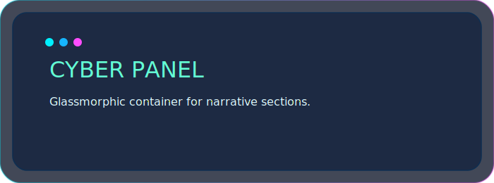
  <h3>Mission Console</h3>
  <p><strong>Nebula Sentinel</strong> is a production-ready security system that feels like a live cyberpunk control room. Combining YOLOv8 detection, MediaPipe skeleton intelligence, and trusted-face recognition, it orchestrates multi-zone defense, Telegram command surfaces, and PyQt6 glassmorphic UI panels.</p>
  <ul>
    <li>Real-time holographic zone rendering with animated scans and breach beacons.</li>
    <li>Adaptive sensitivity curves for YOLO, skeleton, and motion engines.</li>
    <li>Glitch-enhanced HUD dividers and neon beams for instant visual parsing.</li>
  </ul>
</td>
<td width="35%" valign="top">
  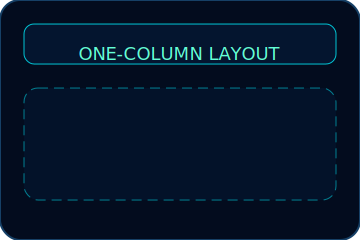
  <ul>
    <li><strong>Core Input</strong>: Live camera or forensic video playback</li>
    <li><strong>Processing</strong>: YOLOv8 + MediaPipe + heat-map fusion</li>
    <li><strong>Orchestration</strong>: Telegram bot, TTS, continuous alarm</li>
    <li><strong>Storage</strong>: Structured alerts, recordings, database stats</li>
  </ul>
</td>
</tr>
</table>

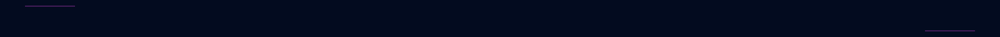

<div align="center">
  
  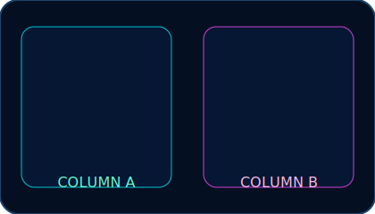
</div>

<table width="100%">
<tr>
<td align="center">
  
  <h3>Adaptive Detection Grid</h3>
  <p>YOLOv8 + MediaPipe pipeline with skeleton enrichment, partial limb tracking, and breach-aware foot locking.</p>
</td>
<td align="center">
  
  <h3>Trusted Persona Cortex</h3>
  <p>Auto-ingests faces, applies tolerance-tuned recognition, issues greetings, and suppresses false alarms.</p>
</td>
<td align="center">
  
  <h3>Holographic Zones</h3>
  <p>3D grids, animated scans, breach walls, and glitch pulses for every monitored perimeter.</p>
</td>
</tr>
<tr>
<td align="center">
  
  <h3>Thermal Motion Heatmaps</h3>
  <p>Decaying heat signatures layered over live feeds for instant anomaly tracing.</p>
</td>
<td align="center">
  
  <h3>Command Mesh</h3>
  <p>Telegram inline keyboards, quick states, remote arming, and snapshot streaming.</p>
</td>
<td align="center">
  
  <h3>Smart Capture Stack</h3>
  <p>Manual/auto recordings, precise snapshots, and AGPL-compliant audit logging.</p>
</td>
</tr>
</table>

### Full Capability Matrix

- 🌌 **Glassmorphic PyQt6 UI** with neon edges, parallax gradients, and animated status bars.
- 🧠 **Multi-Threaded Detection Core** separating acquisition, inference, and motion analysis for low latency.
- 🔐 **Sensitivity Profiles** for low/medium/high contexts, automatically tuning YOLO, skeleton, and motion thresholds.
- 🔄 **Instant Face Reload** without reboot—auto-process, sanitize, and migrate to the fixed image vault.
- 📟 **Cyber-Terminal Panels** for installation logs, usage quick-start, and GitHub widget framing.


<div align="center">
  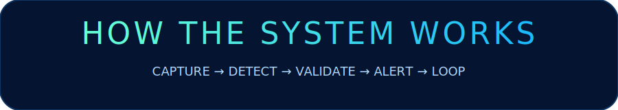
</div>

<table>
<tr>
<td width="55%">
  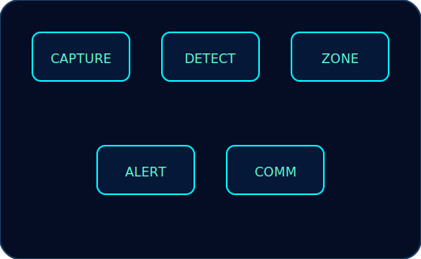
  <h4>Operational Lattice</h4>
  <ol>
    <li><strong>Capture</strong> — Camera/video streams normalized to 1280×720 with real-time HDR tuning.</li>
    <li><strong>Detection</strong> — YOLOv8 draws bboxes, MediaPipe enriches with skeleton landmarks, partial limbs, and foot centers.</li>
    <li><strong>Zone Intelligence</strong> — Multi-zone manager validates bboxes, skeleton points, partial body regions, and motion heatmaps.</li>
    <li><strong>Decision Engine</strong> — Alerts triggered only on verified breaches, respecting trusted-face overrides and motion context.</li>
    <li><strong>Comms</strong> — Telegram bot, TTS, alarms, recordings, and SQLite logs synchronize the response.</li>
  </ol>
</td>
<td width="45%">
  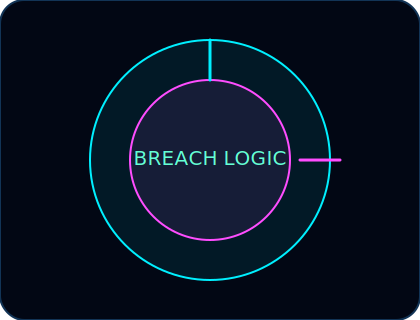
  <h4>Breach Logic Highlights</h4>
  <ul>
    <li>Bounding box corners OR skeleton points inside a zone.</li>
    <li>Partial limbs (hands/feet/torso) intersect custom perimeters.</li>
    <li>Motion heatmaps overlapping active persons inside a zone.</li>
    <li>Trusted face detected ⇒ auto-suppress breach alarms.</li>
  </ul>
</td>
</tr>
</table>

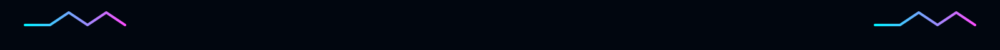

<div align="center">
  
</div>

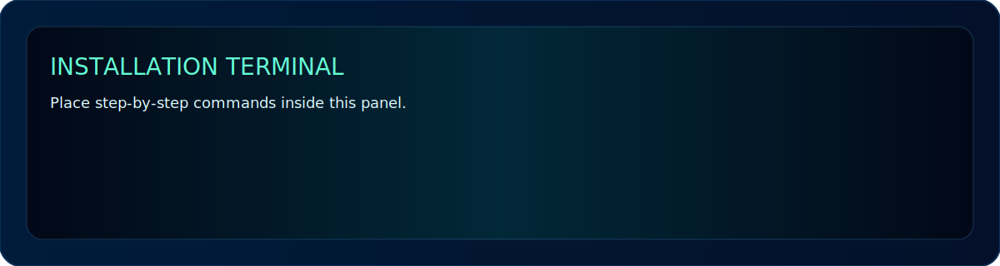

```bash
# 1. Clone
git clone https://github.com/your-user/security-system.git
cd security-system

# 2. (Recommended) Virtual Environment
python -m venv venv
source venv/bin/activate   # Windows: venv\Scripts\activate

# 3. Dependencies
pip install -r requirements.txt
pip install ultralytics              # downloads YOLO weights on demand

# 4. Configure Secrets
# edit config.py with Telegram token/chat ID and optional thresholds

# 5. Launch
python main.py
```

**Prerequisites**
- Python 3.10+ (strict)
- Webcam or recorded surveillance feed
- Discrete GPU preferred for YOLOv8 acceleration (CPU supported with lower FPS)
- Telegram bot token + chat ID if remote control is desired


<div align="center">
  
  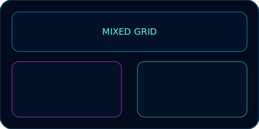
</div>

<table>
<tr>
<td width="50%" valign="top">
  <h4>🎯 Zone Configuration</h4>
  <ol>
    <li>Click <strong>➕ New</strong> then <strong>✏️ Draw</strong>.</li>
    <li>Plot minimum of three points directly on the live feed.</li>
    <li>Use <strong>🔧 Optimize</strong> to convexify and smooth edges.</li>
    <li>Glitch beams visualize active perimeters; animated scans confirm coverage.</li>
  </ol>
  <h4>👤 Trusted-Face Sync</h4>
  <ol>
    <li>Drop curated faces into <code>trusted_faces/</code>.</li>
    <li>Hit <strong>🔄 Reload Faces</strong> or wait for auto-scan.</li>
    <li>System validates, copies into <code>fixed_images/</code>, and broadcasts ready-state.</li>
  </ol>
</td>
<td width="50%" valign="top">
  <h4>⌨️ Power Shortcuts</h4>
  <table>
    <tr><td><code>A</code></td><td>Arm / Disarm</td></tr>
    <tr><td><code>R</code></td><td>Start / Stop recording</td></tr>
    <tr><td><code>Space</code></td><td>Snapshot capture</td></tr>
    <tr><td><code>F11</code></td><td>Toggle fullscreen HUD</td></tr>
  </table>
  <h4>📲 Telegram Commands</h4>
  <table>
    <tr><td><code>/menu</code></td><td>Inline control deck</td></tr>
    <tr><td><code>/arm</code> / <code>/disarm</code></td><td>Security state</td></tr>
    <tr><td><code>/snap</code></td><td>Remote snapshot</td></tr>
    <tr><td><code>/record</code></td><td>Toggle recording</td></tr>
    <tr><td><code>/status</code></td><td>System health pulse</td></tr>
    <tr><td><code>/reload_faces</code></td><td>Refresh trusted DB</td></tr>
  </table>
</td>
</tr>
</table>


<div align="center">
  
</div>

```
security-system/
├── main.py                 # Application entry point (PyQt6 launcher)
├── gui.py                  # Futuristic UI, threads, zone management
├── config.py               # Alert types, paths, sensitivity tuning, secrets
├── detectors.py            # YOLOv8, MediaPipe pose, face recognition, motion
├── utils.py                # Zone geometry, grid rendering, corner detection
├── database.py             # SQLite event + stats storage
├── telegram_bot.py         # Inline keyboard bot + remote commands
├── audio.py                # Text-to-speech + continuous alarm
├── requirements.txt        # Production dependency lock
├── README.md               # This cyber interface
├── LICENSE                 # AGPL-3.0 terms
├── .gitignore              # Ensures clean commits
└── readme_assets/          # All cyberpunk SVGs used in README
```

Auto-created at runtime (do **not** commit): `recordings/`, `snapshots/`, `alerts/`, `trusted_faces/`, `fixed_images/`, `security.db`, `.aye/`, `__pycache__/`, virtual environments, YOLO weights.


<table>
<tr>
<th align="left">✅ Upload</th>
<th align="left">❌ Exclude</th>
</tr>
<tr>
<td>
<ul>
  <li>Source code: <code>main.py</code>, <code>gui.py</code>, <code>config.py</code>, <code>detectors.py</code>, <code>utils.py</code>, <code>database.py</code>, <code>telegram_bot.py</code>, <code>audio.py</code></li>
  <li><code>requirements.txt</code>, <code>README.md</code>, <code>LICENSE</code>, <code>.gitignore</code></li>
  <li><code>readme_assets/</code> (all SVGs below)</li>
</ul>
</td>
<td>
<ul>
  <li>Virtual environments (<code>venv/</code>) and cached packages</li>
  <li>Runtime data: <code>recordings/</code>, <code>snapshots/</code>, <code>alerts/</code>, <code>trusted_faces/</code>, <code>fixed_images/</code>, <code>security.db</code></li>
  <li>Local checkpoints, YOLO weights (<code>yolov8n.pt</code> auto-downloads)</li>
  <li>Editor metadata (<code>.aye/</code>, <code>.vscode/</code>, <code>__pycache__/</code>)</li>
</ul>
</td>
</tr>
</table>


<div align="center">
  
  
</div>

<table>
<tr>
<td align="center" width="50%">
  <h3>📸 Screenshots</h3>
  <p>Embed production shots inside <code>readme_assets/frame-widget.svg</code> for consistent neon framing.</p>
  <ul>
    <li><em>Placeholder:</em> <code>screenshots/dashboard.png</code></li>
    <li><em>Placeholder:</em> <code>screenshots/breach.png</code></li>
  </ul>
</td>
<td align="center" width="50%">
  <h3>🎬 Demo Video / GIF</h3>
  <p>Place a looping HUD capture or link to a cinematic walkthrough.</p>
  <ul>
    <li><em>Placeholder:</em> <code>demo/security_hud.mp4</code></li>
    <li>Wrap thumbnails with <code>readme_assets/frame-widget.svg</code>.</li>
  </ul>
</td>
</tr>
</table>


<div align="center">
  
  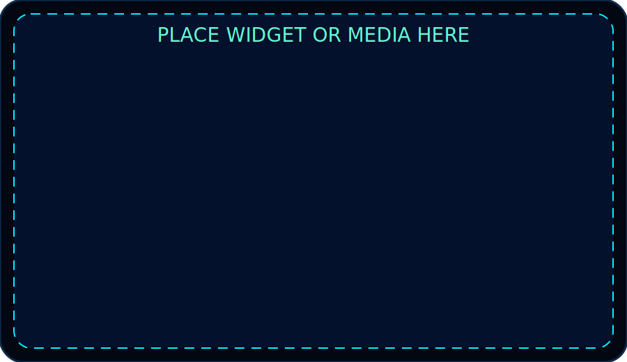
</div>

<p align="center">
  
</p>
<p align="center">
  
</p>
<p align="center">
  
</p>

> Wrap badges, stats, and streak widgets inside the neon frame for a cohesive cyber aesthetic.


<div align="center">
  
</div>

<table>
<tr>
<td>
  
  <h3>AGPL-3.0 Compliance</h3>
  <ul>
    <li>✔ Commercial use, modification, distribution, private use allowed.</li>
    <li>✔ Source disclosure + network interaction rules preserved.</li>
    <li>⚠ Derivatives must remain AGPL-3.0 and publish source for hosted services.</li>
  </ul>
  <p>See <a href="LICENSE">LICENSE</a> for full legal text.</p>
</td>
</tr>
</table>


<div align="center">
  
  <p>
    
  </p>
  <p><strong>Built for operators who demand cinematic situational awareness.</strong></p>
  <p>
    <a href="https://github.com/your-user">GitHub</a> ·
    <a href="https://linkedin.com/in/your-handle">LinkedIn</a> ·
    <a href="https://your-portfolio.com">Portfolio</a>
  </p>
  <p>⭐ Star this repository to keep the defense grid fully charged.</p>
</div>
