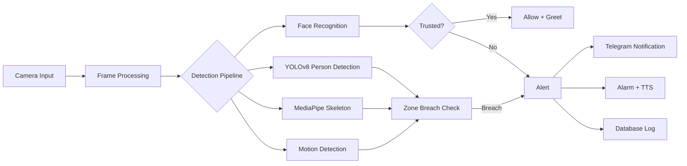

<div align="center">

<!-- Animated Header -->


<!-- Animated Scanning Line -->


<!-- Badges Row 1 -->
<p>
  <a href="#">
    
  </a>
  <a href="#">
    
  </a>
  <a href="#license">
    
  </a>
</p>

<!-- Badges Row 2 -->
<p>
  <a href="#">
    
  </a>
  <a href="#">
    
  </a>
  <a href="#">
    
  </a>
</p>

<!-- Repo Stats -->
<p>
  
  
  
  
</p>

<!-- Activity Graph -->


<!-- Divider -->


<!-- Short Description -->
<h3>
  
  Advanced AI-Powered Security Surveillance System
  
</h3>

<p align="center">
  <em>A next-generation security surveillance system featuring YOLOv8 person detection,<br>
  MediaPipe skeleton tracking, face recognition, multi-zone breach detection,<br>
  and real-time Telegram alerts with remote control capabilities.</em>
</p>

<!-- Quick Links -->
<p>
  <a href="#-installation">Installation</a> •
  <a href="#-features">Features</a> •
  <a href="#-usage">Usage</a> •
  <a href="#-demo">Demo</a> •
  <a href="#-contributing">Contributing</a>
</p>

<!-- Typing SVG -->
<a href="https://git.io/typing-svg"></a>

</div>

<!-- Divider -->


<!-- About Section -->
##  About The Project

<div align="center">
  
</div>

**Sentinel AI** is a comprehensive, AI-powered security surveillance system designed for real-time monitoring and threat detection. Built with Python and leveraging cutting-edge machine learning technologies including YOLOv8 and MediaPipe, it provides enterprise-grade security monitoring with an intuitive PyQt6 graphical interface.

This project was developed as a student initiative to explore the intersection of computer vision, machine learning, and practical security applications. It demonstrates the power of combining multiple AI technologies to create a robust, real-world security solution.

<table align="center">
  <tr>
    <td align="center" width="25%">
      
      <br><strong>YOLOv8 Detection</strong>
      <br><sub>Accurate person detection with no false positives</sub>
    </td>
    <td align="center" width="25%">
      
      <br><strong>Skeleton Tracking</strong>
      <br><sub>Full body pose estimation with 33 landmarks</sub>
    </td>
    <td align="center" width="25%">
      
      <br><strong>Zone Breach</strong>
      <br><sub>Multi-zone intrusion detection</sub>
    </td>
    <td align="center" width="25%">
      
      <br><strong>Telegram Control</strong>
      <br><sub>Remote monitoring & alerts</sub>
    </td>
  </tr>
</table>

<div align="center">
  
</div>

<!-- Features Section -->


<div align="center">

### 🎯 Core Detection Features

</div>

<table>
  <tr>
    <td width="50%">
      <h4>🔍 YOLOv8 Person Detection</h4>
      <ul>
        <li>State-of-the-art YOLOv8 neural network</li>
        <li>Real-time detection at 30+ FPS</li>
        <li>Adjustable confidence thresholds (Low/Medium/High)</li>
        <li>Zero false positives on non-human objects</li>
        <li>Bounding box visualization with confidence scores</li>
      </ul>
    </td>
    <td width="50%">
      <h4>🦴 Skeleton Tracking</h4>
      <ul>
        <li>MediaPipe Pose estimation with 33 landmarks</li>
        <li>Partial body detection (face, hands, feet, torso)</li>
        <li>Real-time skeleton visualization</li>
        <li>Works even with partial body visibility</li>
        <li>Foot position tracking for precise zone detection</li>
      </ul>
    </td>
  </tr>
  <tr>
    <td width="50%">
      <h4>👤 Face Recognition</h4>
      <ul>
        <li>128-dimensional face encoding</li>
        <li>Trusted persons database</li>
        <li>Auto-processing of new trusted faces</li>
        <li>Personalized greetings via TTS</li>
        <li>Unknown intruder detection</li>
      </ul>
    </td>
    <td width="50%">
      <h4>🎯 Multi-Zone Breach Detection</h4>
      <ul>
        <li>Draw custom detection zones</li>
        <li>3D perspective visualization</li>
        <li>Animated scanning effects</li>
        <li>Multiple simultaneous zones</li>
        <li>Auto-detect floor corners</li>
      </ul>
    </td>
  </tr>
</table>

<div align="center">

### 📱 Remote Control & Alerts

</div>

<table>
  <tr>
    <td width="50%">
      <h4>📲 Telegram Integration</h4>
      <ul>
        <li>Real-time intrusion alerts with photos</li>
        <li>Inline keyboard controls</li>
        <li>Remote arm/disarm system</li>
        <li>Snapshot on demand</li>
        <li>Status queries and statistics</li>
        <li>Recording control</li>
        <li>Sensitivity adjustment</li>
        <li>Night vision toggle</li>
      </ul>
    </td>
    <td width="50%">
      <h4>🔔 Alert System</h4>
      <ul>
        <li>Instant breach notifications</li>
        <li>Continuous alarm with mute option</li>
        <li>Text-to-speech announcements</li>
        <li>Auto-record on breach</li>
        <li>Configurable photo intervals</li>
        <li>Complete event logging</li>
        <li>Daily statistics tracking</li>
        <li>SQLite event database</li>
      </ul>
    </td>
  </tr>
</table>

<div align="center">

### ✨ Additional Features

<p>
  
  
  
  
</p>

<p>
  
  
  
  
</p>

</div>

<!-- Divider -->


<!-- Tech Stack Section -->


<div align="center">

<table>
  <tr>
    <td align="center" width="100">
      
      <br><strong>Python</strong>
      <br><sub>3.10+</sub>
    </td>
    <td align="center" width="100">
      
      <br><strong>PyTorch</strong>
      <br><sub>Backend</sub>
    </td>
    <td align="center" width="100">
      
      <br><strong>OpenCV</strong>
      <br><sub>Vision</sub>
    </td>
    <td align="center" width="100">
      
      <br><strong>NumPy</strong>
      <br><sub>Computing</sub>
    </td>
    <td align="center" width="100">
      
      <br><strong>SQLite</strong>
      <br><sub>Database</sub>
    </td>
  </tr>
  <tr>
    <td align="center" width="100">
      
      <br><strong>YOLOv8</strong>
      <br><sub>Detection</sub>
    </td>
    <td align="center" width="100">
      
      <br><strong>MediaPipe</strong>
      <br><sub>Pose</sub>
    </td>
    <td align="center" width="100">
      
      <br><strong>Telegram</strong>
      <br><sub>Alerts</sub>
    </td>
    <td align="center" width="100">
      
      <br><strong>PyQt6</strong>
      <br><sub>GUI</sub>
    </td>
    <td align="center" width="100">
      
      <br><strong>dlib</strong>
      <br><sub>Faces</sub>
    </td>
  </tr>
</table>

### 📊 Technology Breakdown



</div>

<!-- Divider -->


<!-- Installation Section -->


### 📋 Prerequisites

<table>
  <tr>
    <td>
      
      <strong>System Requirements</strong>
    </td>
  </tr>
  <tr>
    <td>
      <ul>
        <li><strong>Python:</strong> 3.10 or higher</li>
        <li><strong>RAM:</strong> 8GB minimum (16GB recommended)</li>
        <li><strong>GPU:</strong> NVIDIA GPU recommended for faster detection (optional)</li>
        <li><strong>Camera:</strong> Webcam or IP camera</li>
        <li><strong>OS:</strong> Windows 10/11, macOS, or Linux</li>
        <li><strong>Storage:</strong> 2GB for dependencies + space for recordings</li>
      </ul>
    </td>
  </tr>
</table>

### 🚀 Quick Start

<details open>
<summary><strong>Step 1: Clone the Repository</strong></summary>

```bash
# Clone the repository
git clone https://github.com/yourusername/sentinel-ai.git

# Navigate to project directory
cd sentinel-ai
```

</details>

<details open>
<summary><strong>Step 2: Create Virtual Environment</strong></summary>

```bash
# Create virtual environment
python -m venv venv

# Activate virtual environment
# On Windows:
venv\Scripts\activate

# On macOS/Linux:
source venv/bin/activate
```

</details>

<details open>
<summary><strong>Step 3: Install Dependencies</strong></summary>

```bash
# Install required packages
pip install -r requirements.txt
```

> **⚠️ Note for dlib installation:**
> 
> If you encounter issues installing `dlib`, you may need:
> 
> **Windows:**
> ```bash
> pip install cmake
> pip install dlib
> ```
> 
> **macOS:**
> ```bash
> brew install cmake
> pip install dlib
> ```
> 
> **Linux (Ubuntu/Debian):**
> ```bash
> sudo apt-get install cmake libboost-all-dev
> pip install dlib
> ```

</details>

<details open>
<summary><strong>Step 4: Configure Telegram Bot (Optional)</strong></summary>

1. Create a bot with [@BotFather](https://t.me/botfather) on Telegram
2. Get your bot token and chat ID
3. Update `config.py` with your credentials:

```python
TELEGRAM_BOT_TOKEN = "your_bot_token_here"
TELEGRAM_CHAT_ID = "your_chat_id_here"
```

> **💡 Tip:** To get your chat ID, message your bot and visit:
> `https://api.telegram.org/bot<YOUR_TOKEN>/getUpdates`

</details>

<details open>
<summary><strong>Step 5: Add Trusted Faces (Optional)</strong></summary>

```bash
# Add photos of trusted persons to the trusted_faces folder
# Name files with the person's name (e.g., "John.jpg", "Jane.png")
# The system will auto-process them on startup
```

</details>

<details open>
<summary><strong>Step 6: Run the Application</strong></summary>

```bash
python main.py
```

</details>

### 📦 Dependencies

```txt
# Core Framework
PyQt6>=6.4.0           # Modern GUI framework

# Computer Vision
opencv-python>=4.8.0   # Image processing
numpy>=1.24.0          # Numerical computing

# AI/ML Detection
ultralytics>=8.0.0     # YOLOv8 object detection
mediapipe>=0.10.0      # Pose estimation

# Face Recognition
face-recognition>=1.3.0 # Face encoding & matching
dlib>=19.24.0          # Face detection backend

# Audio
pyttsx3>=2.90          # Text-to-speech
pygame>=2.5.0          # Audio playback

# Networking
requests>=2.31.0       # Telegram API
```

<!-- Divider -->


<!-- Project Structure Section -->


```
sentinel-ai/
│
├── 📄 main.py                 # Application entry point
├── 📄 config.py               # Configuration settings & constants
├── 📄 database.py             # SQLite database operations
├── 📄 detectors.py            # YOLOv8, MediaPipe, Face Recognition
├── 📄 gui.py                  # PyQt6 main window & UI components
├── 📄 telegram_bot.py         # Telegram bot integration
├── 📄 audio.py                # TTS engine & alarm system
├── 📄 utils.py                # Detection zones & utilities
├── 📄 requirements.txt        # Python dependencies
├── 📄 README.md               # Project documentation
├── 📄 LICENSE                 # AGPL-3.0 License
├── 📄 .gitignore              # Git ignore rules
│
├── 📁 readme_assets/          # README SVG assets
│   ├── 🎨 header.svg
│   ├── 🎨 divider.svg
│   ├── 🎨 scanning-line.svg
│   ├── 🎨 wave-top.svg
│   ├── 🎨 wave-bottom.svg
│   ├── 🎨 features-header.svg
│   ├── 🎨 tech-stack-header.svg
│   ├── 🎨 installation-header.svg
│   ├── 🎨 architecture-header.svg
│   ├── 🎨 usage-header.svg
│   ├── 🎨 demo-header.svg
│   ├── 🎨 security-header.svg
│   ├── 🎨 contributing-header.svg
│   ├── 🎨 license-header.svg
│   └── 🎨 footer.svg
│
└── 📁 trusted_faces/          # Drop trusted person photos here
    └── 📷 (your photos)
```

### 📂 Auto-Generated Folders

These folders are created automatically at runtime:

| Folder | Purpose |
|--------|--------|
| `recordings/` | Saved video recordings |
| `snapshots/` | Manual snapshots |
| `alerts/` | Breach alert photos |
| `fixed_images/` | Processed trusted faces database |

<!-- Divider -->


<!-- Usage Section -->


### 🎯 Quick Start Guide

<table>
  <tr>
    <td align="center" width="20%">
      
      <br><strong>1. Launch</strong>
      <br><sub><code>python main.py</code></sub>
    </td>
    <td align="center" width="20%">
      
      <br><strong>2. Draw Zone</strong>
      <br><sub>Click to add points</sub>
    </td>
    <td align="center" width="20%">
      
      <br><strong>3. Arm</strong>
      <br><sub>Enable monitoring</sub>
    </td>
    <td align="center" width="20%">
      
      <br><strong>4. Monitor</strong>
      <br><sub>Watch for alerts</sub>
    </td>
    <td align="center" width="20%">
      
      <br><strong>5. Control</strong>
      <br><sub>Via Telegram</sub>
    </td>
  </tr>
</table>

### 📖 Detailed Usage

<details>
<summary><strong>🎯 Creating Detection Zones</strong></summary>

1. Click **"➕ New"** to create a new zone
2. Click **"✏️ Draw"** to enter drawing mode
3. Click on the video feed to add corner points (minimum 3)
4. Click **"✅ Done"** when finished
5. Optionally click **"🔧 Optimize"** to smooth the zone
6. Use **"🤖 Auto-Detect"** to automatically find floor corners

> **💡 Tip:** Create multiple zones for different areas. Each zone can be independently monitored.

</details>

<details>
<summary><strong>🔒 Arming the System</strong></summary>

1. Click the **"🔒 ARM SYSTEM"** button
2. The status indicator will turn green
3. Any person entering a zone will trigger an alert
4. Trusted faces will be announced but won't trigger alarms
5. Click **"🔓 DISARM"** to disable monitoring

**Keyboard Shortcut:** Press `A` to toggle arm/disarm

</details>

<details>
<summary><strong>👤 Adding Trusted Faces</strong></summary>

1. Take clear photos of trusted persons (front-facing, good lighting)
2. Name the files with the person's name (e.g., `John.jpg`, `Alice.png`)
3. Copy the photos to the `trusted_faces/` folder
4. Click **"🔄 Reload Faces"** or restart the application
5. The system will greet trusted persons by name

> **📷 Photo Tips:**
> - Use well-lit, front-facing photos
> - One face per image
> - Supported formats: JPG, JPEG, PNG, BMP

</details>

<details>
<summary><strong>📱 Telegram Commands</strong></summary>

| Command | Description |
|---------|-------------|
| `/start` or `/menu` | Show control panel |
| `arm` | Arm the system |
| `disarm` | Disarm the system |
| `snap` | Take a snapshot |
| `record` | Start recording |
| `stoprecord` | Stop recording |
| `mute` | Mute alarm |
| `unmute` | Unmute alarm |
| `status` | Get system status |
| `stats` | View daily statistics |
| `log` | View recent events |
| `reload_faces` | Reload trusted faces |
| `nightmode on/off` | Toggle night vision |
| `sensitivity low/medium/high` | Adjust detection sensitivity |

</details>

<details>
<summary><strong>⌨️ Keyboard Shortcuts</strong></summary>

| Key | Action |
|-----|--------|
| `Space` | Take snapshot |
| `A` | Toggle arm/disarm |
| `R` | Toggle recording |
| `F11` | Toggle fullscreen |
| `Escape` | Exit fullscreen |

</details>

<details>
<summary><strong>🎥 Video Playback Mode</strong></summary>

1. Click the source toggle to switch to **"📁 Video File"**
2. Click **"📁 Load Video"** to select a video file
3. Use playback controls:
   - ⏪ Skip back 10 seconds
   - ⏸/▶ Play/Pause
   - ⏩ Skip forward 10 seconds
   - Slider for seeking
4. Detection works on video files too!

</details>

<details>
<summary><strong>⚙️ Adjusting Sensitivity</strong></summary>

| Level | YOLO Confidence | Best For |
|-------|-----------------|----------|
| **Low** | 60% | Reduce false positives, outdoor use |
| **Medium** | 40% | Balanced detection (default) |
| **High** | 25% | Maximum sensitivity, catch everything |

Adjust via the dropdown in the GUI or Telegram command.

</details>

<!-- Divider -->


<!-- Demo Section -->


<div align="center">

### 📸 Screenshots

<!-- Screenshot placeholders - Replace with actual screenshots -->
<table>
  <tr>
    <td align="center">
      
      <br><sub><strong>Main Dashboard</strong></sub>
    </td>
    <td align="center">
      
      <br><sub><strong>Zone Breach Detection</strong></sub>
    </td>
  </tr>
  <tr>
    <td align="center">
      
      <br><sub><strong>Skeleton Tracking</strong></sub>
    </td>
    <td align="center">
      
      <br><sub><strong>Telegram Alerts</strong></sub>
    </td>
  </tr>
</table>

### 🎬 Demo Video

<!-- Video placeholder - Replace with actual video link -->
<a href="#">
  
</a>

<p><em>Click the image above to watch the full demonstration</em></p>

</div>

<!-- Divider -->


<!-- Security Section -->


<div align="center">

### 🛡️ Security & Privacy

</div>

<table>
  <tr>
    <td width="50%">
      <h4>🔒 Data Protection</h4>
      <ul>
        <li>All data stored locally - no cloud uploads</li>
        <li>Face encodings never leave your machine</li>
        <li>SQLite database with local file storage</li>
        <li>Telegram alerts are the only external communication</li>
        <li>No telemetry or usage tracking</li>
      </ul>
    </td>
    <td width="50%">
      <h4>⚠️ Important Notes</h4>
      <ul>
        <li>Secure your Telegram bot token</li>
        <li>Don't commit <code>config.py</code> with real credentials</li>
        <li>Recordings may contain sensitive footage</li>
        <li>Trusted faces folder contains biometric data</li>
        <li>Use strong system passwords</li>
      </ul>
    </td>
  </tr>
</table>

> ⚠️ **Disclaimer:** This system is designed for personal/educational use. For commercial or high-security deployments, additional security measures and compliance considerations may be required. Always comply with local laws regarding surveillance and data protection.

<!-- Divider -->


<!-- Contributing Section -->


<div align="center">

Contributions are what make the open source community amazing! Any contributions you make are **greatly appreciated**.

</div>

### 🤝 How to Contribute

1. **Fork** the repository
2. **Create** your feature branch (`git checkout -b feature/AmazingFeature`)
3. **Commit** your changes (`git commit -m 'Add some AmazingFeature'`)
4. **Push** to the branch (`git push origin feature/AmazingFeature`)
5. **Open** a Pull Request

### 📝 Contribution Ideas

- [ ] Add more detection models (YOLOv9, etc.)
- [ ] Implement object tracking (DeepSORT)
- [ ] Add web dashboard interface
- [ ] Support for IP cameras (RTSP)
- [ ] Mobile app companion
- [ ] Cloud backup option
- [ ] Multi-language TTS support
- [ ] Action recognition (falling, fighting, etc.)

### 🐛 Reporting Issues

Found a bug? Please open an issue with:
- Clear description of the problem
- Steps to reproduce
- Expected vs actual behavior
- System information (OS, Python version, GPU)
- Error messages/logs if applicable

<!-- Divider -->


<!-- License Section -->


<div align="center">

This project is licensed under the **GNU Affero General Public License v3.0**

<a href="LICENSE">
  
</a>

</div>

```
Sentinel AI - Advanced Security Surveillance System
Copyright (C) 2024

This program is free software: you can redistribute it and/or modify
it under the terms of the GNU Affero General Public License as published
by the Free Software Foundation, either version 3 of the License, or
(at your option) any later version.

This program is distributed in the hope that it will be useful,
but WITHOUT ANY WARRANTY; without even the implied warranty of
MERCHANTABILITY or FITNESS FOR A PARTICULAR PURPOSE. See the
GNU Affero General Public License for more details.

You should have received a copy of the GNU Affero General Public License
along with this program. If not, see <https://www.gnu.org/licenses/>.
```

### 📜 What AGPL-3.0 Means

- ✅ You can use, modify, and distribute this software
- ✅ You can use it for commercial purposes
- ⚠️ You must disclose source code of modifications
- ⚠️ You must use the same license for derivatives
- ⚠️ Network use counts as distribution

<!-- Divider -->


<!-- Acknowledgments -->
## 🙏 Acknowledgments

<div align="center">

<table>
  <tr>
    <td align="center">
      <a href="https://github.com/ultralytics/ultralytics">
        
      </a>
    </td>
    <td align="center">
      <a href="https://github.com/google/mediapipe">
        
      </a>
    </td>
    <td align="center">
      <a href="https://github.com/ageitgey/face_recognition">
        
      </a>
    </td>
    <td align="center">
      <a href="https://opencv.org/">
        
      </a>
    </td>
  </tr>
</table>

Special thanks to all the open-source projects that made this possible!

</div>

<!-- Divider -->


<!-- Contact -->
## 📬 Contact

<div align="center">

<p>
  <a href="https://github.com/yourusername">
    
  </a>
  <a href="mailto:your.email@example.com">
    
  </a>
  <a href="https://linkedin.com/in/yourusername">
    
  </a>
</p>

<sub>Built with 💙 by a passionate student developer</sub>

</div>

<!-- Footer -->


<div align="center">

### ⭐ Star this repository if you found it helpful!

<p>
  
  
  
</p>

<!-- Profile Views Counter -->


</div>
