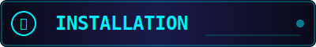

<div align="center">


<br>

[](https://python.org)
[](https://opencv.org)
[](https://ultralytics.com)
[](https://riverbankcomputing.com/software/pyqt/)
[](LICENSE)

<br>

```
╔══════════════════════════════════════════════════════════════════════════════╗
║  ███████╗███████╗ ██████╗██╗   ██╗██████╗ ██╗████████╗██╗   ██╗              ║
║  ██╔════╝██╔════╝██╔════╝██║   ██║██╔══██╗██║╚══██╔══╝╚██╗ ██╔╝              ║
║  ███████╗█████╗  ██║     ██║   ██║██████╔╝██║   ██║    ╚████╔╝               ║
║  ╚════██║██╔══╝  ██║     ██║   ██║██╔══██╗██║   ██║     ╚██╔╝                ║
║  ███████║███████╗╚██████╗╚██████╔╝██║  ██║██║   ██║      ██║                 ║
║  ╚══════╝╚══════╝ ╚═════╝ ╚═════╝ ╚═╝  ╚═╝╚═╝   ╚═╝      ╚═╝                 ║
║                     ███████╗██╗   ██╗███████╗████████╗███████╗███╗   ███╗    ║
║                     ██╔════╝╚██╗ ██╔╝██╔════╝╚══██╔══╝██╔════╝████╗ ████║    ║
║                     ███████╗ ╚████╔╝ ███████╗   ██║   █████╗  ██╔████╔██║    ║
║                     ╚════██║  ╚██╔╝  ╚════██║   ██║   ██╔══╝  ██║╚██╔╝██║    ║
║                     ███████║   ██║   ███████║   ██║   ███████╗██║ ╚═╝ ██║    ║
║                     ╚══════╝   ╚═╝   ╚══════╝   ╚═╝   ╚══════╝╚═╝     ╚═╝    ║
╠══════════════════════════════════════════════════════════════════════════════╣
║  [ STATUS: OPERATIONAL ]  [ VERSION: 2.0 ]  [ THREAT LEVEL: MONITORING ]     ║
╚══════════════════════════════════════════════════════════════════════════════╝
```

<br>

**AI-Powered Real-Time Surveillance • YOLOv8 Detection • Face Recognition • Zone Monitoring**

</div>

<br>


<br>

<!-- ═══════════════════════════════════════════════════════════════════════════ -->
<!-- OVERVIEW -->
<!-- ═══════════════════════════════════════════════════════════════════════════ -->

<div align="center">


</div>

<br>

<table>
<tr>
<td width="60%">

### 🛡️ What is Security System?

A **next-generation AI-powered surveillance system** built for real-time threat detection and monitoring. Combining state-of-the-art **YOLOv8 object detection**, **MediaPipe skeleton tracking**, and **face recognition**, this system provides comprehensive security coverage with instant alerts.

```
┌─────────────────────────────────────────────┐
│  SYSTEM CAPABILITIES                        │
├─────────────────────────────────────────────┤
│  ► Real-time person detection (YOLOv8)      │
│  ► Skeleton & partial body tracking         │
│  ► Trusted face recognition                 │
│  ► Custom zone breach detection             │
│  ► Motion heat map visualization            │
│  ► Telegram remote control                  │
│  ► Continuous alarm system                  │
│  ► Video recording & snapshots              │
└─────────────────────────────────────────────┘
```

</td>
<td width="40%" align="center">

```
    ╔═══════════════════╗
    ║   ┌───────────┐   ║
    ║   │ ◉ CAMERA  │   ║
    ║   │  ┌─────┐  │   ║
    ║   │  │ 👤  │  │   ║
    ║   │  │SCAN │  │   ║
    ║   │  └─────┘  │   ║
    ║   └───────────┘   ║
    ║                   ║
    ║  STATUS: ARMED    ║
    ║  ████████████░░   ║
    ║  DETECTION: 94%   ║
    ╚═══════════════════╝
```

</td>
</tr>
</table>

<br>


<br>

<!-- ═══════════════════════════════════════════════════════════════════════════ -->
<!-- FEATURES -->
<!-- ═══════════════════════════════════════════════════════════════════════════ -->

<div align="center">


</div>

<br>

<table width="100%">
<tr>
<td align="center" width="33%">

### 🎯 Detection Engine

```
┌──────────────────┐
│    YOLOv8 +      │
│   MediaPipe      │
│  ┌────────────┐  │
│  │ ○ ○ ○ ○ ○  │  │
│  │ ├─┼─┼─┼─┤  │  │
│  │ │ │ │ │ │  │  │
│  │ ├─┴─┴─┴─┤  │  │
│  │ │       │  │  │
│  │ ┴       ┴  │  │
│  └────────────┘  │
└──────────────────┘
```

- YOLOv8 person detection
- 33-point skeleton tracking
- Partial body detection
- Adjustable sensitivity
- Real-time processing

</td>
<td align="center" width="33%">

### 👤 Face Recognition

```
┌──────────────────┐
│   FACE SCAN      │
│  ┌────────────┐  │
│  │  ┌──────┐  │  │
│  │  │ ◠  ◠ │  │  │
│  │  │  ──  │  │  │
│  │  │ ╰──╯ │  │  │
│  │  └──────┘  │  │
│  │ ▓▓▓▓▓▓▓▓▓▓ │  │
│  │ MATCH: 94% │  │
│  └────────────┘  │
└──────────────────┘
```

- Trusted faces database
- Auto-process new faces
- Personalized greetings
- Intruder identification
- Configurable tolerance

</td>
<td align="center" width="33%">

### 🔲 Zone Monitoring

```
┌──────────────────┐
│   ZONE BREACH    │
│  ┌────────────┐  │
│  │╔══════════╗│  │
│  │║ ░░░░░░░░ ║│  │
│  │║ ░ ⚠️ ░░ ║│  │
│  │║ ░░░░░░░░ ║│  │
│  │╚══════════╝│  │
│  │  ALERT!    │  │
│  └────────────┘  │
└──────────────────┘
```

- Custom polygon zones
- Multi-zone support
- 3D visualization
- Auto-detect corners
- Breach duration tracking

</td>
</tr>
</table>

<br>

<table width="100%">
<tr>
<td align="center" width="33%">

### 📱 Telegram Control

```
┌──────────────────┐
│  REMOTE CONTROL  │
│  ┌────────────┐  │
│  │ 🔒 ARM     │  │
│  │ 📸 SNAP    │  │
│  │ ⏺ RECORD  │  │
│  │ 📊 STATUS  │  │
│  │ ⚙️ SETTINGS│  │
│  └────────────┘  │
│  ► CONNECTED     │
└──────────────────┘
```

- Inline button controls
- Real-time alerts
- Photo notifications
- Status reports
- Remote arm/disarm

</td>
<td align="center" width="33%">

### 🔥 Motion Detection

```
┌──────────────────┐
│   HEAT MAP       │
│  ┌────────────┐  │
│  │ ░░▒▒▓▓██░░ │  │
│  │ ░▒▒▓▓████▒ │  │
│  │ ▒▓▓██████▓ │  │
│  │ ░▒▓▓████▒░ │  │
│  │ ░░▒▒▓▓▒░░░ │  │
│  └────────────┘  │
│  ACTIVITY: HIGH  │
└──────────────────┘
```

- Real-time heat maps
- Motion region tracking
- Configurable threshold
- Visual overlay
- Activity history

</td>
<td align="center" width="33%">

### 🔊 Alarm System

```
┌──────────────────┐
│  ALARM STATUS    │
│  ┌────────────┐  │
│  │    🔔      │  │
│  │  ╱    ╲    │  │
│  │ ╱ ALERT ╲  │  │
│  │ ╲      ╱   │  │
│  │  ╲    ╱    │  │
│  │   ════     │  │
│  └────────────┘  │
│  FREQ: 880Hz     │
└──────────────────┘
```

- Continuous alarm
- Text-to-speech alerts
- Mute/unmute control
- Configurable frequency
- Auto-stop on trusted

</td>
</tr>
</table>

<br>

### 📋 Complete Feature List

<details>
<summary><b>Click to expand full feature list</b></summary>

<br>

| Category | Feature | Description |
|----------|---------|-------------|
| **Detection** | YOLOv8 Integration | State-of-the-art person detection with adjustable confidence |
| | Skeleton Tracking | 33-point MediaPipe pose estimation |
| | Partial Body Detection | Detect face, hands, feet, torso, arms, legs separately |
| | Motion Detection | Frame differencing with heat map visualization |
| **Recognition** | Face Recognition | dlib-based face encoding and matching |
| | Trusted Faces | Auto-process and store trusted person database |
| | Personalized Greetings | TTS greetings for recognized individuals |
| **Zones** | Custom Zones | Draw polygon detection zones |
| | Multi-Zone | Support for multiple independent zones |
| | 3D Visualization | Animated zone rendering with perspective |
| | Auto-Detect | Automatic corner detection for zone creation |
| **Alerts** | Telegram Integration | Full remote control via Telegram bot |
| | Photo Alerts | Automatic snapshot on breach detection |
| | Audio Alarm | Continuous alarm with configurable frequency |
| | TTS Announcements | Voice alerts for system events |
| **Recording** | Video Recording | AVI format continuous recording |
| | Snapshots | On-demand and automatic photo capture |
| | Auto-Record | Automatic recording on motion/breach |
| **Interface** | Dark Theme GUI | Cyberpunk-styled PyQt6 interface |
| | Night Vision | Enhanced low-light visualization |
| | Video Playback | Load and analyze recorded videos |
| | Multi-Camera | Support for multiple camera sources |
| **Settings** | Sensitivity Levels | Low/Medium/High detection presets |
| | Brightness/Contrast | Real-time camera adjustments |
| | Configurable Thresholds | Fine-tune all detection parameters |

</details>

<br>


<br>

<!-- ═══════════════════════════════════════════════════════════════════════════ -->
<!-- HOW IT WORKS -->
<!-- ═══════════════════════════════════════════════════════════════════════════ -->

<div align="center">

## ⚙️ How the System Works

</div>

<br>

```
┌─────────────────────────────────────────────────────────────────────────────────────┐
│                           SECURITY SYSTEM ARCHITECTURE                               │
├─────────────────────────────────────────────────────────────────────────────────────┤
│                                                                                     │
│   ┌──────────┐     ┌──────────────┐     ┌──────────────┐     ┌──────────────┐      │
│   │  CAMERA  │────►│  FRAME       │────►│  DETECTION   │────►│  ANALYSIS    │      │
│   │  INPUT   │     │  CAPTURE     │     │  THREAD      │     │  ENGINE      │      │
│   └──────────┘     └──────────────┘     └──────────────┘     └──────────────┘      │
│        │                  │                    │                    │               │
│        │                  │                    │                    │               │
│        ▼                  ▼                    ▼                    ▼               │
│   ┌──────────┐     ┌──────────────┐     ┌──────────────┐     ┌──────────────┐      │
│   │  VIDEO   │     │  BRIGHTNESS  │     │   YOLOv8     │     │  ZONE        │      │
│   │  FILE    │     │  CONTRAST    │     │   MEDIAPIPE  │     │  BREACH      │      │
│   └──────────┘     │  NIGHT MODE  │     │   MOTION     │     │  CHECK       │      │
│                    └──────────────┘     └──────────────┘     └──────────────┘      │
│                                                                    │               │
│                                                                    ▼               │
│   ┌──────────────────────────────────────────────────────────────────────────┐    │
│   │                         RESPONSE SYSTEM                                   │    │
│   ├──────────────┬──────────────┬──────────────┬──────────────┬─────────────┤    │
│   │   TELEGRAM   │    ALARM     │     TTS      │   RECORD     │   DATABASE  │    │
│   │   ALERTS     │    SYSTEM    │   ANNOUNCE   │   VIDEO      │   LOGGING   │    │
│   └──────────────┴──────────────┴──────────────┴──────────────┴─────────────┘    │
│                                                                                     │
└─────────────────────────────────────────────────────────────────────────────────────┘
```

<br>

### 🔄 Processing Pipeline

<table>
<tr>
<td width="25%" align="center">

**1️⃣ CAPTURE**
```
┌─────────┐
│ ◉ ◉ ◉   │
│ ┌─────┐ │
│ │     │ │
│ │ 📷  │ │
│ │     │ │
│ └─────┘ │
└─────────┘
```
Frame acquisition from camera or video file at 30 FPS

</td>
<td width="25%" align="center">

**2️⃣ DETECT**
```
┌─────────┐
│ YOLO v8 │
│ ┌─────┐ │
│ │ ┌─┐ │ │
│ │ │█│ │ │
│ │ └─┘ │ │
│ └─────┘ │
└─────────┘
```
Person detection + skeleton extraction + motion analysis

</td>
<td width="25%" align="center">

**3️⃣ ANALYZE**
```
┌─────────┐
│ BREACH? │
│ ┌─────┐ │
│ │ ⚠️  │ │
│ │ ═══ │ │
│ │ YES │ │
│ └─────┘ │
└─────────┘
```
Zone breach check + face recognition + threat assessment

</td>
<td width="25%" align="center">

**4️⃣ RESPOND**
```
┌─────────┐
│ ACTION! │
│ ┌─────┐ │
│ │ 🔔  │ │
│ │ 📱  │ │
│ │ 💾  │ │
│ └─────┘ │
└─────────┘
```
Alarm + Telegram alert + recording + database log

</td>
</tr>
</table>

<br>


<br>

<!-- ═══════════════════════════════════════════════════════════════════════════ -->
<!-- INSTALLATION -->
<!-- ═══════════════════════════════════════════════════════════════════════════ -->

<div align="center">



</div>

<br>

### 📦 Prerequisites

```
┌────────────────────────────────────────────────────────────┐
│  SYSTEM REQUIREMENTS                                       │
├────────────────────────────────────────────────────────────┤
│  ► Python 3.10 or higher                                   │
│  ► CUDA-compatible GPU (recommended for YOLOv8)            │
│  ► Webcam or IP camera                                     │
│  ► 8GB RAM minimum                                         │
│  ► Windows 10/11, Linux, or macOS                          │
└────────────────────────────────────────────────────────────┘
```

<br>

### 🚀 Quick Install

```bash
# Clone the repository
git clone https://github.com/Binivert/Security-System.git
cd Security-System

# Create virtual environment (recommended)
python -m venv venv
source venv/bin/activate  # Linux/macOS
venv\Scripts\activate     # Windows

# Install dependencies
pip install -r requirements.txt
```

<br>

### 📋 Dependencies

```
┌────────────────────────────────────────────────────────────┐
│  REQUIRED PACKAGES                                         │
├────────────────────────────────────────────────────────────┤
│                                                            │
│  GUI Framework                                             │
│  └── PyQt6>=6.4.0                                          │
│                                                            │
│  Computer Vision                                           │
│  ├── opencv-python>=4.8.0                                  │
│  ├── numpy>=1.24.0                                         │
│  └── ultralytics (YOLOv8)                                  │
│                                                            │
│  AI/ML                                                     │
│  ├── mediapipe>=0.10.0                                     │
│  ├── face-recognition>=1.3.0                               │
│  └── dlib>=19.24.0                                         │
│                                                            │
│  Audio                                                     │
│  ├── pyttsx3>=2.90                                         │
│  └── pygame>=2.5.0                                         │
│                                                            │
│  Networking                                                │
│  └── requests>=2.31.0                                      │
│                                                            │
└────────────────────────────────────────────────────────────┘
```

<br>

### ⚠️ Platform-Specific Notes

<details>
<summary><b>Windows Installation Notes</b></summary>

```bash
# Install Visual Studio Build Tools for dlib
# Download from: https://visualstudio.microsoft.com/visual-cpp-build-tools/

# Install CMake
pip install cmake

# Then install face-recognition
pip install face-recognition
```

</details>

<details>
<summary><b>Linux Installation Notes</b></summary>

```bash
# Install system dependencies
sudo apt-get update
sudo apt-get install -y build-essential cmake
sudo apt-get install -y libgtk-3-dev libboost-all-dev

# Install Python packages
pip install -r requirements.txt
```

</details>

<details>
<summary><b>macOS Installation Notes</b></summary>

```bash
# Install Homebrew dependencies
brew install cmake
brew install boost

# Install Python packages
pip install -r requirements.txt
```

</details>

<br>


<br>

<!-- ═══════════════════════════════════════════════════════════════════════════ -->
<!-- USAGE -->
<!-- ═══════════════════════════════════════════════════════════════════════════ -->

<div align="center">


</div>

<br>

### ▶️ Starting the System

```bash
# Run the main application
python main.py
```

<br>

### 🎮 Control Panel

```
╔═══════════════════════════════════════════════════════════════════════════╗
║                        SECURITY SYSTEM CONTROLS                            ║
╠═══════════════════════════════════════════════════════════════════════════╣
║                                                                           ║
║   ┌─────────────────────────────────────────────────────────────────┐    ║
║   │  KEYBOARD SHORTCUTS                                              │    ║
║   ├─────────────────────────────────────────────────────────────────┤    ║
║   │  [A]         Arm/Disarm system                                   │    ║
║   │  [R]         Start/Stop recording                                │    ║
║   │  [SPACE]     Take snapshot                                       │    ║
║   │  [F11]       Toggle fullscreen                                   │    ║
║   │  [ESC]       Exit fullscreen                                     │    ║
║   └─────────────────────────────────────────────────────────────────┘    ║
║                                                                           ║
║   ┌─────────────────────────────────────────────────────────────────┐    ║
║   │  GUI CONTROLS                                                    │    ║
║   ├─────────────────────────────────────────────────────────────────┤    ║
║   │  🔒 ARM SYSTEM      Toggle system armed state                    │    ║
║   │  ⏺ Record          Start/stop video recording                   │    ║
║   │  📸 Snap            Capture snapshot                             │    ║
║   │  🔇 Mute            Mute/unmute alarm                            │    ║
║   │  ➕ New Zone        Create new detection zone                    │    ║
║   │  ✏️ Draw            Enter zone drawing mode                      │    ║
║   │  🤖 Auto-Detect     Auto-detect floor corners                    │    ║
║   │  🔄 Reload Faces    Reload trusted faces database                │    ║
║   └─────────────────────────────────────────────────────────────────┘    ║
║                                                                           ║
╚═══════════════════════════════════════════════════════════════════════════╝
```

<br>

### 📱 Telegram Commands

```
┌────────────────────────────────────────────────────────────┐
│  TELEGRAM BOT COMMANDS                                     │
├────────────────────────────────────────────────────────────┤
│                                                            │
│  /start, /menu     Show main control panel                 │
│  /arm              Arm the security system                 │
│  /disarm           Disarm the security system              │
│  /snap             Take and send snapshot                  │
│  /record           Start recording                         │
│  /stoprecord       Stop recording                          │
│  /mute             Mute alarm                              │
│  /unmute           Unmute alarm                            │
│  /status           Get system status                       │
│  /stats            Get daily statistics                    │
│  /log              Get recent events                       │
│  /reload_faces     Reload trusted faces                    │
│  /nightmode on     Enable night vision                     │
│  /nightmode off    Disable night vision                    │
│  /sensitivity low  Set low sensitivity                     │
│  /sensitivity med  Set medium sensitivity                  │
│  /sensitivity high Set high sensitivity                    │
│                                                            │
└────────────────────────────────────────────────────────────┘
```

<br>

### 👤 Adding Trusted Faces

1. Place face images in the `trusted_faces/` folder
2. Name files with the person's name (e.g., `John.jpg`)
3. System auto-processes and moves to `fixed_images/`
4. Or click "🔄 Reload Faces" to manually refresh

```
trusted_faces/
├── John.jpg
├── Jane.png
└── Admin.jpeg
```

<br>


<br>

<!-- ═══════════════════════════════════════════════════════════════════════════ -->
<!-- FILE STRUCTURE -->
<!-- ═══════════════════════════════════════════════════════════════════════════ -->

<div align="center">


</div>

<br>

### 📁 Project Structure

```
Security-System/
│
├── 📄 main.py                 # Application entry point
├── 📄 gui.py                  # PyQt6 main window & UI
├── 📄 detectors.py            # YOLOv8, MediaPipe, motion detection
├── 📄 config.py               # Configuration settings
├── 📄 database.py             # SQLite database management
├── 📄 telegram_bot.py         # Telegram bot integration
├── 📄 audio.py                # TTS and alarm systems
├── 📄 utils.py                # Zone detection utilities
├── 📄 requirements.txt        # Python dependencies
├── 📄 README.md               # This file
├── 📄 LICENSE                 # AGPL-3.0 license
│
├── 📁 trusted_faces/          # Drop trusted face images here
├── 📁 fixed_images/           # Processed trusted faces (auto)
├── 📁 recordings/             # Video recordings (auto)
├── 📁 snapshots/              # Captured snapshots (auto)
├── 📁 alerts/                 # Alert snapshots (auto)
└── 📁 readme_assets/          # README SVG assets
```

<br>

### ✅ Required Files to Upload to GitHub

```
┌────────────────────────────────────────────────────────────┐
│  UPLOAD THESE FILES                                        │
├────────────────────────────────────────────────────────────┤
│                                                            │
│  ✓ main.py              Entry point                        │
│  ✓ gui.py               GUI implementation                 │
│  ✓ detectors.py         Detection modules                  │
│  ✓ config.py            Configuration                      │
│  ✓ database.py          Database manager                   │
│  ✓ telegram_bot.py      Telegram integration               │
│  ✓ audio.py             Audio systems                      │
│  ✓ utils.py             Utilities                          │
│  ✓ requirements.txt     Dependencies                       │
│  ✓ README.md            Documentation                      │
│  ✓ LICENSE              License file                       │
│  ✓ readme_assets/       README SVG assets                  │
│  ✓ .gitignore           Git ignore rules                   │
│                                                            │
└────────────────────────────────────────────────────────────┘
```

```
┌────────────────────────────────────────────────────────────┐
│  DO NOT UPLOAD (Add to .gitignore)                         │
├────────────────────────────────────────────────────────────┤
│                                                            │
│  ✗ venv/                Virtual environment                │
│  ✗ __pycache__/         Python cache                       │
│  ✗ *.pyc                Compiled Python                    │
│  ✗ .aye/                Aye Chat snapshots                 │
│  ✗ recordings/          Video recordings                   │
│  ✗ snapshots/           Captured images                    │
│  ✗ alerts/              Alert images                       │
│  ✗ trusted_faces/       Personal face images               │
│  ✗ fixed_images/        Processed faces                    │
│  ✗ security.db          Local database                     │
│  ✗ *.avi, *.mp4         Video files                        │
│  ✗ enhanced_alarm_system/  Unused folder                   │
│  ✗ fix_image.py         Unused script                      │
│                                                            │
└────────────────────────────────────────────────────────────┘
```

<br>


<br>

<!-- ═══════════════════════════════════════════════════════════════════════════ -->
<!-- DEMO -->
<!-- ═══════════════════════════════════════════════════════════════════════════ -->

<div align="center">


</div>

<br>

### 📸 Screenshots

<table>
<tr>
<td width="50%" align="center">

**Main Interface**

```
┌─────────────────────────────────┐
│  [Screenshot Placeholder]       │
│                                 │
│  Add screenshot of main GUI     │
│  showing video feed and         │
│  control panel                  │
│                                 │
└─────────────────────────────────┘
```

</td>
<td width="50%" align="center">

**Zone Detection**

```
┌─────────────────────────────────┐
│  [Screenshot Placeholder]       │
│                                 │
│  Add screenshot showing         │
│  active detection zones         │
│  with 3D visualization          │
│                                 │
└─────────────────────────────────┘
```

</td>
</tr>
<tr>
<td width="50%" align="center">

**Skeleton Tracking**

```
┌─────────────────────────────────┐
│  [Screenshot Placeholder]       │
│                                 │
│  Add screenshot showing         │
│  person with skeleton           │
│  overlay visualization          │
│                                 │
└─────────────────────────────────┘
```

</td>
<td width="50%" align="center">

**Telegram Control**

```
┌─────────────────────────────────┐
│  [Screenshot Placeholder]       │
│                                 │
│  Add screenshot of Telegram     │
│  bot with inline keyboard       │
│  and alert notification         │
│                                 │
└─────────────────────────────────┘
```

</td>
</tr>
</table>

<br>

### 🎬 Demo Video

```
┌─────────────────────────────────────────────────────────────────┐
│                                                                 │
│                    [Demo Video Placeholder]                     │
│                                                                 │
│     Add a GIF or link to demo video showing:                    │
│     • System startup and initialization                         │
│     • Person detection with skeleton overlay                    │
│     • Zone creation and breach detection                        │
│     • Face recognition and trusted person greeting              │
│     • Telegram alerts and remote control                        │
│                                                                 │
└─────────────────────────────────────────────────────────────────┘
```

<br>


<br>

<!-- ═══════════════════════════════════════════════════════════════════════════ -->
<!-- GITHUB STATS -->
<!-- ═══════════════════════════════════════════════════════════════════════════ -->

<div align="center">

## 📊 Project Analytics

<br>

<table>
<tr>
<td align="center">


</td>
</tr>
</table>

<br>

<table width="100%">
<tr>
<td align="center" width="50%">


</td>
<td align="center" width="50%">

```
╔════════════════════════════════╗
║     REPOSITORY METRICS         ║
╠════════════════════════════════╣
║  Language: Python 100%         ║
║  License:  AGPL-3.0            ║
║  Status:   Active Development  ║
║  Version:  2.0.0               ║
╚════════════════════════════════╝
```

</td>
</tr>
</table>

<br>

### 👨‍💻 Author Stats

<table width="100%">
<tr>
<td align="center">


</td>
<td align="center">


</td>
</tr>
</table>

<br>


</div>

<br>


<br>

<!-- ═══════════════════════════════════════════════════════════════════════════ -->
<!-- LICENSE -->
<!-- ═══════════════════════════════════════════════════════════════════════════ -->

<div align="center">

## 📜 License

<br>

```
╔═══════════════════════════════════════════════════════════════════════════════╗
║                                                                               ║
║                     GNU AFFERO GENERAL PUBLIC LICENSE                         ║
║                        Version 3, 19 November 2007                            ║
║                                                                               ║
║  Copyright (C) 2024 Binivert                                                  ║
║                                                                               ║
║  This program is free software: you can redistribute it and/or modify         ║
║  it under the terms of the GNU Affero General Public License as published     ║
║  by the Free Software Foundation, either version 3 of the License, or         ║
║  (at your option) any later version.                                          ║
║                                                                               ║
║  This program is distributed in the hope that it will be useful,              ║
║  but WITHOUT ANY WARRANTY; without even the implied warranty of               ║
║  MERCHANTABILITY or FITNESS FOR A PARTICULAR PURPOSE. See the                 ║
║  GNU Affero General Public License for more details.                          ║
║                                                                               ║
║  You should have received a copy of the GNU Affero General Public License     ║
║  along with this program. If not, see <https://www.gnu.org/licenses/>.        ║
║                                                                               ║
╚═══════════════════════════════════════════════════════════════════════════════╝
```

<br>

[](https://www.gnu.org/licenses/agpl-3.0)

</div>

<br>


<br>

<!-- ═══════════════════════════════════════════════════════════════════════════ -->
<!-- FOOTER -->
<!-- ═══════════════════════════════════════════════════════════════════════════ -->

<div align="center">

<br>

```
╔═══════════════════════════════════════════════════════════════════════════════╗
║                                                                               ║
║   ██████╗ ██╗   ██╗██╗██╗  ████████╗    ██████╗ ██╗   ██╗                     ║
║   ██╔══██╗██║   ██║██║██║  ╚══██╔══╝    ██╔══██╗╚██╗ ██╔╝                     ║
║   ██████╔╝██║   ██║██║██║     ██║       ██████╔╝ ╚████╔╝                      ║
║   ██╔══██╗██║   ██║██║██║     ██║       ██╔══██╗  ╚██╔╝                       ║
║   ██████╔╝╚██████╔╝██║███████╗██║       ██████╔╝   ██║                        ║
║   ╚═════╝  ╚═════╝ ╚═╝╚══════╝╚═╝       ╚═════╝    ╚═╝                        ║
║                                                                               ║
║                         🛡️ BINIVERT 🛡️                                        ║
║                                                                               ║
║            [ Computer Vision Engineer | AI Enthusiast | Creator ]             ║
║                                                                               ║
╚═══════════════════════════════════════════════════════════════════════════════╝
```

<br>

**If this project helped you, consider giving it a ⭐**

<br>

<a href="https://github.com/Binivert"></a>
<a href="https://linkedin.com/in/bintrion"></a>
<a href="mailto:bintrion@gmail.com"></a>

<br>

---

<sub>Made with 💙 and lots of ☕ | © 2024 Binivert</sub>

</div>
