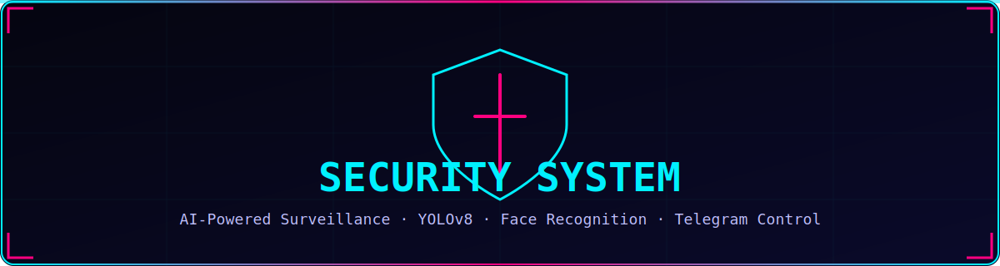
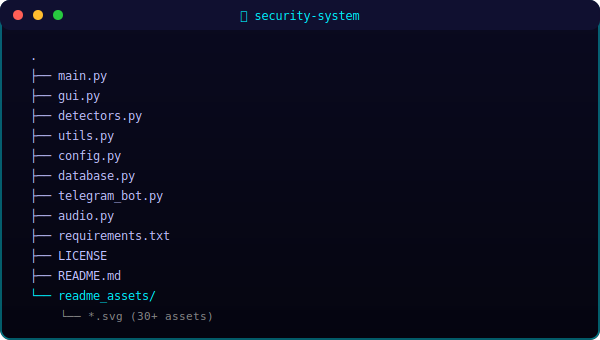

<div align="center">

<!-- ══════════════════════════════════════════════════════════════════════════ -->
<!-- HERO BANNER -->
<!-- ══════════════════════════════════════════════════════════════════════════ -->



<br/>

<!-- Quick Badges -->


<br/><br/>

</div>


<br/>

<!-- ══════════════════════════════════════════════════════════════════════════ -->
<!-- OVERVIEW -->
<!-- ══════════════════════════════════════════════════════════════════════════ -->

<div align="center">

</div>

<br/>

> **Smart Security System** is an AI-powered surveillance solution built for real-time intrusion detection.  
> It combines **YOLOv8** object detection, **MediaPipe** skeleton tracking, **face recognition**, and **Telegram** remote control into a sleek PyQt6 dashboard.

<br/>

<table width="100%">
<tr>
<td width="50%" valign="top">

### ⚡ Core Capabilities
- Real-time **YOLOv8** person detection
- **Skeleton & partial-body** tracking via MediaPipe
- **Face recognition** with trusted-person allow-list
- **Multi-zone** breach detection with 3-D visualisation
- **Motion heat-map** overlay
- **Telegram bot** with inline-button controls
- **Text-to-speech** alerts & continuous alarm

</td>
<td width="50%" valign="top">

### 🎯 Use Cases
- Home & office surveillance
- Restricted-area monitoring
- Retail loss-prevention
- Research & prototyping
- Educational demonstrations

</td>
</tr>
</table>

<br/>


<br/>

<!-- ══════════════════════════════════════════════════════════════════════════ -->
<!-- FEATURES -->
<!-- ══════════════════════════════════════════════════════════════════════════ -->

<div align="center">

</div>

<br/>

<table width="100%">
<tr>
<td align="center" width="25%"><br/><strong>YOLOv8 Detection</strong><br/><sub>Accurate person tracking</sub></td>
<td align="center" width="25%"><br/><strong>Multi-Zone</strong><br/><sub>Draw custom polygons</sub></td>
<td align="center" width="25%"><br/><strong>Continuous Alarm</strong><br/><sub>Audio + Telegram alerts</sub></td>
<td align="center" width="25%"><br/><strong>Telegram Control</strong><br/><sub>Arm/disarm remotely</sub></td>
</tr>
<tr>
<td align="center"><br/><strong>Face Recognition</strong><br/><sub>Trusted-person bypass</sub></td>
<td align="center"><br/><strong>Motion Heat-Map</strong><br/><sub>Visualise activity</sub></td>
<td align="center"><br/><strong>Night Vision</strong><br/><sub>Low-light enhancement</sub></td>
<td align="center"><br/><strong>Recording</strong><br/><sub>Manual & auto-record</sub></td>
</tr>
<tr>
<td align="center"><br/><strong>Snapshots</strong><br/><sub>Instant captures</sub></td>
<td align="center"><br/><strong>Sensitivity</strong><br/><sub>Low / Med / High</sub></td>
<td align="center"><br/><strong>TTS Alerts</strong><br/><sub>Voice announcements</sub></td>
<td align="center"><br/><strong>Video Playback</strong><br/><sub>Review recordings</sub></td>
</tr>
</table>

<br/>


<br/>

<!-- ══════════════════════════════════════════════════════════════════════════ -->
<!-- HOW IT WORKS -->
<!-- ══════════════════════════════════════════════════════════════════════════ -->

<div align="center">

</div>

<br/>

<div align="center">

</div>

<br/>

| Step | Component | Description |
|:----:|-----------|-------------|
| 1 | **Camera / Video** | Captures frames at 30 FPS |
| 2 | **Detection Thread** | Runs YOLOv8 + MediaPipe in background |
| 3 | **Zone Check** | Tests skeleton landmarks against polygons |
| 4 | **Face Recognition** | Identifies trusted persons |
| 5 | **Alert Engine** | Triggers alarm, TTS, Telegram, snapshot |
| 6 | **GUI Render** | Overlays zones, heat-map, status |

<br/>


<br/>

<!-- ══════════════════════════════════════════════════════════════════════════ -->
<!-- INSTALLATION -->
<!-- ══════════════════════════════════════════════════════════════════════════ -->

<div align="center">

</div>

<br/>

```bash
# 1. Clone the repository
git clone https://github.com/Binivert/security-system.git
cd security-system

# 2. Create virtual environment (recommended)
python -m venv venv
source venv/bin/activate   # Windows: venv\Scripts\activate

# 3. Install dependencies
pip install -r requirements.txt

# 4. (Optional) Configure Telegram credentials in config.py
#    TELEGRAM_BOT_TOKEN = "your_token"
#    TELEGRAM_CHAT_ID   = "your_chat_id"
```

<br/>


<br/>

<!-- ══════════════════════════════════════════════════════════════════════════ -->
<!-- USAGE -->
<!-- ══════════════════════════════════════════════════════════════════════════ -->

<div align="center">

</div>

<br/>

```bash
python main.py
```

| Hotkey | Action |
|--------|--------|
| `A` | Toggle Arm / Disarm |
| `R` | Toggle Recording |
| `Space` | Take Snapshot |
| `F11` | Fullscreen |
| `Esc` | Exit Fullscreen |

**Telegram Commands** (inline buttons or text):

`/arm` · `/disarm` · `/snap` · `/record` · `/stoprecord` · `/mute` · `/unmute` · `/status` · `/stats` · `/log` · `/reload_faces` · `/sensitivity low|medium|high` · `/nightmode on|off`

<br/>


<br/>

<!-- ══════════════════════════════════════════════════════════════════════════ -->
<!-- FILE STRUCTURE -->
<!-- ══════════════════════════════════════════════════════════════════════════ -->

<div align="center">

</div>

<br/>

<div align="center">

</div>

<br/>

<details>
<summary><strong>📂 Expand full tree</strong></summary>

```
security-system/
├── main.py              # Entry point
├── gui.py               # PyQt6 main window
├── detectors.py         # YOLO, MediaPipe, face recognition
├── utils.py             # Zone & corner utilities
├── config.py            # Settings & paths
├── database.py          # SQLite event logging
├── telegram_bot.py      # Telegram integration
├── audio.py             # TTS & alarm
├── requirements.txt     # Python dependencies
├── LICENSE              # AGPL-3.0
├── README.md            # This file
└── readme_assets/       # SVG assets for README
```

</details>

<br/>


<br/>

<!-- ══════════════════════════════════════════════════════════════════════════ -->
<!-- DEMO -->
<!-- ══════════════════════════════════════════════════════════════════════════ -->

<div align="center">

</div>

<br/>

<div align="center">

<!-- Screenshot Placeholder -->


<br/><br/>

*Replace the placeholder above with an actual screenshot or GIF.*

</div>

<br/>


<br/>

<!-- ══════════════════════════════════════════════════════════════════════════ -->
<!-- GITHUB STATS -->
<!-- ══════════════════════════════════════════════════════════════════════════ -->

<div align="center">

</div>

<br/>

<div align="center">

</div>

<br/>

<div align="center">


&nbsp;&nbsp;


</div>

<br/>


<br/>

<!-- ══════════════════════════════════════════════════════════════════════════ -->
<!-- LICENSE -->
<!-- ══════════════════════════════════════════════════════════════════════════ -->

<div align="center">

</div>

<br/>

```
Copyright © 2024 Binivert

This program is free software: you can redistribute it and/or modify
it under the terms of the GNU Affero General Public License as published
by the Free Software Foundation, either version 3 of the License, or
(at your option) any later version.

This program is distributed in the hope that it will be useful,
but WITHOUT ANY WARRANTY; without even the implied warranty of
MERCHANTABILITY or FITNESS FOR A PARTICULAR PURPOSE. See the
GNU Affero General Public License for more details.

You should have received a copy of the GNU Affero General Public License
along with this program. If not, see <https://www.gnu.org/licenses/>.
```

<br/>


<br/>

<div align="center">

</div>
