<div align="center">


<br>

<!-- STATUS BADGES -->


<br>


</div>

<br>

<!-- ═══════════════════════════════════════════════════════════════ -->
<!-- OVERVIEW -->
<!-- ═══════════════════════════════════════════════════════════════ -->

<div align="center">

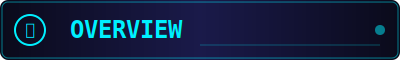

</div>

<br>

<table>
<tr>
<td>

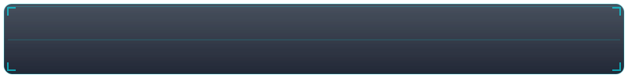

**Advanced AI-Powered Security System** — A comprehensive real-time surveillance solution combining state-of-the-art computer vision with intelligent threat detection.

Built with **YOLOv8** for person detection, **MediaPipe** for skeleton tracking, and **face_recognition** for trusted person identification. Features multi-zone breach detection, Telegram remote control, and a futuristic PyQt6 interface.

> *"Security reimagined for the cyberpunk age"*

</td>
</tr>
</table>

<br>


<br>

<!-- ═══════════════════════════════════════════════════════════════ -->
<!-- FEATURES -->
<!-- ═══════════════════════════════════════════════════════════════ -->

<div align="center">

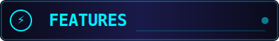

</div>

<br>

<table width="100%">
<tr>
<td align="center" width="33%">
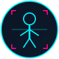
<br><br>
<h3>🎯 YOLOv8 Detection</h3>
<p>Real-time person detection with adjustable sensitivity (Low/Medium/High). Skeleton tracking via MediaPipe for comprehensive body part detection.</p>
</td>
<td align="center" width="33%">

<br><br>
<h3>👤 Face Recognition</h3>
<p>Trusted person database with automatic greeting. Auto-processes new faces from the trusted_faces folder. Intruder vs trusted differentiation.</p>
</td>
<td align="center" width="33%">
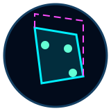
<br><br>
<h3>🛡️ Zone Breach Detection</h3>
<p>Draw custom detection zones with 3D visualization. Multi-zone support with independent monitoring. Animated holographic zone rendering.</p>
</td>
</tr>
<tr>
<td align="center" width="33%">

<br><br>
<h3>📱 Telegram Control</h3>
<p>Full remote control via inline keyboard buttons. Real-time alerts with snapshots. Arm/disarm, record, snapshot, and status commands.</p>
</td>
<td align="center" width="33%">
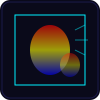
<br><br>
<h3>🔥 Motion Heat Map</h3>
<p>Visual motion tracking with thermal-style overlay. Configurable sensitivity thresholds. Combines with skeleton detection for accuracy.</p>
</td>
<td align="center" width="33%">
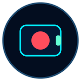
<br><br>
<h3>📹 Smart Recording</h3>
<p>Manual or auto-triggered recording on breach. Snapshot capture with timestamp. Local storage with organized folder structure.</p>
</td>
</tr>
</table>

<br>

### Additional Features

<table width="100%">
<tr>
<td width="50%">

- 🌙 **Night Vision Mode** — Enhanced low-light visibility
- 🔊 **Audio Alerts** — Continuous alarm with TTS announcements
- 📊 **Statistics Dashboard** — Daily detection/alert tracking
- 🗄️ **SQLite Database** — Event logging and history
- 🎥 **Video Playback** — Analyze recorded footage with controls
- 🖥️ **Multi-Camera Support** — Switch between available cameras

</td>
<td width="50%">

- ⚡ **Real-time Processing** — 60 FPS display, 20 FPS detection
- 🎨 **Cyberpunk UI** — Dark theme with neon accents
- 🔧 **Auto Zone Detection** — Corner detection for quick setup
- 🔄 **Hot Reload Faces** — Add trusted faces without restart
- ⌨️ **Keyboard Shortcuts** — Quick access to all functions
- 📐 **Adjustable Settings** — Brightness, contrast, sensitivity

</td>
</tr>
</table>

<br>


<br>

<!-- ═══════════════════════════════════════════════════════════════ -->
<!-- HOW IT WORKS -->
<!-- ═══════════════════════════════════════════════════════════════ -->

<div align="center">


</div>

<br>

<div align="center">
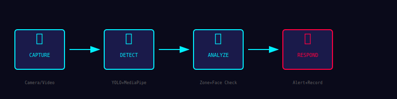
</div>

<br>

### Detection Pipeline

```
┌─────────────────────────────────────────────────────────────────────────────┐
│                           SECURITY SYSTEM PIPELINE                          │
├─────────────────────────────────────────────────────────────────────────────┤
│                                                                             │
│   ┌──────────┐    ┌──────────┐    ┌──────────┐    ┌──────────┐             │
│   │  CAMERA  │───▶│  YOLOv8  │───▶│ SKELETON │───▶│   ZONE   │             │
│   │  INPUT   │    │ DETECTION│    │ TRACKING │    │  CHECK   │             │
│   └──────────┘    └──────────┘    └──────────┘    └────┬─────┘             │
│                                                        │                    │
│                         ┌──────────────────────────────┘                    │
│                         ▼                                                   │
│   ┌──────────┐    ┌──────────┐    ┌──────────┐    ┌──────────┐             │
│   │  MOTION  │───▶│   FACE   │───▶│  ALERT   │───▶│ TELEGRAM │             │
│   │ ANALYSIS │    │  RECOG   │    │  ENGINE  │    │   BOT    │             │
│   └──────────┘    └──────────┘    └──────────┘    └──────────┘             │
│                                                                             │
└─────────────────────────────────────────────────────────────────────────────┘
```

<br>

### Zone Breach Logic

The system triggers a breach alert when **ANY** of the following conditions are met:

| Check | Description |
|-------|-------------|
| **Bounding Box** | Person's detection box corners overlap with zone |
| **Skeleton Points** | Any visible skeleton landmark inside zone |
| **Partial Body** | Detected body parts (hand, foot, torso) in zone |
| **Motion + Skeleton** | Motion detected in zone combined with person presence |

<br>


<br>

<!-- ═══════════════════════════════════════════════════════════════ -->
<!-- INSTALLATION -->
<!-- ═══════════════════════════════════════════════════════════════ -->

<div align="center">


</div>

<br>

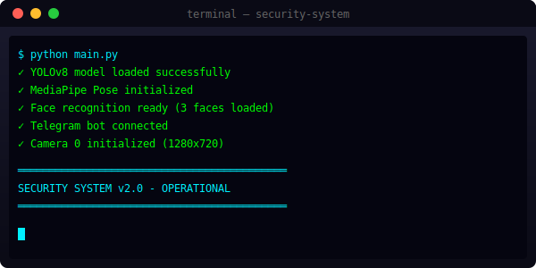

### Prerequisites

- **Python 3.10+** required
- **Webcam** or video file for input
- **GPU** recommended for optimal YOLO performance (CPU works but slower)

### Step 1: Clone the Repository

```bash
git clone https://github.com/Binivert/Security-System.git
cd Security-System
```

### Step 2: Create Virtual Environment (Recommended)

```bash
python -m venv venv

# Windows
venv\Scripts\activate

# Linux/Mac
source venv/bin/activate
```

### Step 3: Install Dependencies

```bash
pip install -r requirements.txt
```

### Step 4: Install YOLOv8 (Auto-downloads model on first run)

```bash
pip install ultralytics
```

### Step 5: Configure Telegram (Optional)

Edit `config.py` and set your Telegram credentials:

```python
TELEGRAM_BOT_TOKEN = "your_bot_token_here"
TELEGRAM_CHAT_ID = "your_chat_id_here"
```

<br>


<br>

<!-- ═══════════════════════════════════════════════════════════════ -->
<!-- USAGE -->
<!-- ═══════════════════════════════════════════════════════════════ -->

<div align="center">

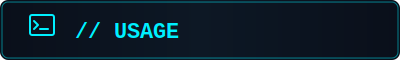

</div>

<br>

### Starting the System

```bash
python main.py
```

<br>

### Quick Start Guide

<table width="100%">
<tr>
<td width="50%">

#### 🎯 Setting Up Detection Zones

1. Click **"➕ New"** to create a zone
2. Click **"✏️ Draw"** to enter drawing mode
3. Click on the video to add zone points (minimum 3)
4. Click **"✅ Done"** when finished
5. Use **"🔧 Optimize"** to smooth the zone

</td>
<td width="50%">

#### 👤 Adding Trusted Faces

1. Place face images in `trusted_faces/` folder
2. Click **"🔄 Reload Faces"** or wait for auto-detect
3. System will process and move to `fixed_images/`
4. Trusted persons won't trigger alerts

</td>
</tr>
</table>

<br>

### Keyboard Shortcuts

| Key | Action |
|-----|--------|
| `A` | Toggle Arm/Disarm |
| `R` | Toggle Recording |
| `Space` | Take Snapshot |
| `F11` | Toggle Fullscreen |
| `Esc` | Exit Fullscreen |

<br>

### Telegram Commands

| Command | Description |
|---------|-------------|
| `/menu` | Show control panel |
| `/arm` | Arm the system |
| `/disarm` | Disarm the system |
| `/snap` | Take snapshot |
| `/record` | Start recording |
| `/status` | Get current status |
| `/stats` | View daily statistics |
| `/reload_faces` | Reload trusted faces |

<br>


<br>

<!-- ═══════════════════════════════════════════════════════════════ -->
<!-- FILE STRUCTURE -->
<!-- ═══════════════════════════════════════════════════════════════ -->

<div align="center">

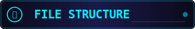

</div>

<br>

### Project Structure (Production Files Only)

```
Security-System/
│
├── main.py                 # Application entry point
├── gui.py                  # PyQt6 main window and UI
├── config.py               # Configuration settings
├── detectors.py            # YOLOv8, skeleton, face detection
├── utils.py                # Zone management utilities
├── database.py             # SQLite database manager
├── telegram_bot.py         # Telegram bot integration
├── audio.py                # TTS and alarm components
├── requirements.txt        # Python dependencies
├── README.md               # This file
│
├── readme_assets/          # README SVG assets
│   ├── header-main.svg
│   ├── divider-neon.svg
│   ├── section-*.svg
│   ├── icon-*.svg
│   └── ...
│
├── trusted_faces/          # Drop face images here (auto-created)
├── fixed_images/           # Processed face database (auto-created)
├── recordings/             # Video recordings (auto-created)
├── snapshots/              # Captured snapshots (auto-created)
└── alerts/                 # Alert images (auto-created)
```

<br>

### Files to Upload to GitHub

<table width="100%">
<tr>
<th>✅ Include</th>
<th>❌ Exclude</th>
</tr>
<tr>
<td>

- `main.py`
- `gui.py`
- `config.py`
- `detectors.py`
- `utils.py`
- `database.py`
- `telegram_bot.py`
- `audio.py`
- `requirements.txt`
- `README.md`
- `readme_assets/` folder
- `.gitignore`
- `LICENSE`

</td>
<td>

- `venv/` — Virtual environment
- `__pycache__/` — Python cache
- `*.pyc` — Compiled files
- `security.db` — Local database
- `recordings/` — Video files
- `snapshots/` — Image files
- `alerts/` — Alert images
- `trusted_faces/` — Personal images
- `fixed_images/` — Processed faces
- `yolov8n.pt` — YOLO model (auto-downloads)
- `.aye/` — IDE snapshots

</td>
</tr>
</table>

<br>


<br>

<!-- ═══════════════════════════════════════════════════════════════ -->
<!-- DEMO -->
<!-- ═══════════════════════════════════════════════════════════════ -->

<div align="center">


</div>

<br>

<div align="center">
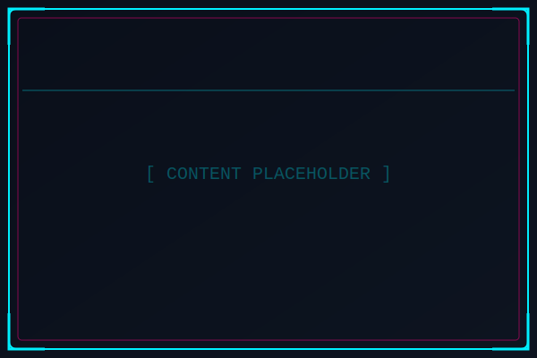
</div>

<br>

<table width="100%">
<tr>
<td align="center" width="50%">

### 📸 Screenshots

*Coming Soon*

<!-- Replace with actual screenshots -->
<!--  -->
<!--  -->
<!--  -->

</td>
<td align="center" width="50%">

### 🎬 Demo Video

*Coming Soon*

<!-- Replace with actual demo -->
<!-- [](https://www.youtube.com/watch?v=VIDEO_ID) -->

</td>
</tr>
</table>

<br>


<br>

<!-- ═══════════════════════════════════════════════════════════════ -->
<!-- GITHUB STATS -->
<!-- ═══════════════════════════════════════════════════════════════ -->

<div align="center">

### 📊 Repository Statistics

<br>


<br><br>


<br>


</div>

<br>


<br>

<!-- ═══════════════════════════════════════════════════════════════ -->
<!-- LICENSE -->
<!-- ═══════════════════════════════════════════════════════════════ -->

<div align="center">


</div>

<br>

<table>
<tr>
<td>


### AGPL-3.0 License

This project is licensed under the **GNU Affero General Public License v3.0**.

- ✅ Commercial use allowed
- ✅ Modification allowed
- ✅ Distribution allowed
- ✅ Private use allowed
- ⚠️ Must disclose source code
- ⚠️ Must use same license
- ⚠️ Network use requires source disclosure

See [LICENSE](LICENSE) for full details.

</td>
</tr>
</table>

<br>


<br>

<!-- ═══════════════════════════════════════════════════════════════ -->
<!-- FOOTER -->
<!-- ═══════════════════════════════════════════════════════════════ -->

<div align="center">


<br><br>

### Built with 💜 by [Binivert](https://github.com/Binivert)

<br>

<a href="https://github.com/Binivert"></a>
<a href="https://linkedin.com/in/bintrion"></a>
<a href="https://ravini.net"></a>

<br><br>

⭐ **Star this repo if you find it useful!** ⭐

</div>
