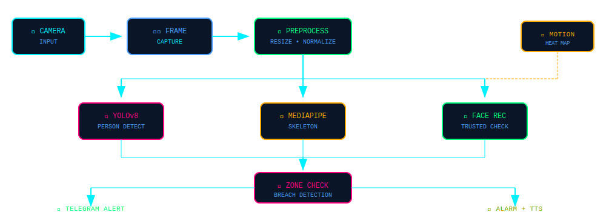

<div align="center">


</div>

<br>


<br>

<!-- ═══════════════════════════════════════════════════════════════ -->
<!-- SYSTEM OVERVIEW -->
<!-- ═══════════════════════════════════════════════════════════════ -->

<div align="center">


</div>

<br>

**Security System** is an advanced AI-powered surveillance platform that transforms any camera into an intelligent monitoring station. Built with cutting-edge computer vision technologies, it provides real-time person detection, facial recognition, motion analysis, and instant alerts—all controllable from your Telegram app.

The system combines **YOLOv8** for accurate person detection, **MediaPipe** for skeleton tracking, and **face_recognition** for trusted person identification. When an intruder enters a defined security zone, the system immediately triggers alarms, captures evidence, and sends notifications to your phone.

**Key Capabilities:**
- 🎯 **Zero false positives** with YOLOv8 neural network detection
- 🦴 **Full skeleton tracking** detects partial body intrusions (hands, feet, etc.)
- 👤 **Trusted person recognition** automatically disarms for known faces
- 📱 **Complete Telegram control** with inline buttons and real-time status
- 🔥 **Motion heat mapping** visualizes activity patterns over time
- 🎨 **Professional GUI** with night vision, recording, and zone drawing

<br>


<br>

<!-- ═══════════════════════════════════════════════════════════════ -->
<!-- CORE FEATURES -->
<!-- ═══════════════════════════════════════════════════════════════ -->

<div align="center">


<br><br>

| Feature | Description |
|:-------:|:------------|
|  | **YOLOv8 Detection** — State-of-the-art neural network for accurate person detection with adjustable sensitivity (Low/Medium/High) |
|  | **Skeleton Tracking** — MediaPipe pose estimation tracks 33 body landmarks for comprehensive breach detection |
|  | **Face Recognition** — Identifies trusted persons and automatically suppresses false alarms with personalized greetings |
|  | **3D Security Zones** — Draw custom polygonal zones with animated visualization and real-time breach detection |
|  | **Motion Heat Map** — Visualizes movement patterns with color-coded intensity overlay |
|  | **Telegram Integration** — Full remote control with inline buttons, live snapshots, and instant alerts |
|  | **Smart Alarm System** — Audio alerts with text-to-speech announcements and mute controls |
|  | **Multi-Source Input** — Supports live cameras and video file playback with full transport controls |

</div>

<br>


<br>

<!-- ═══════════════════════════════════════════════════════════════ -->
<!-- HOW IT WORKS -->
<!-- ═══════════════════════════════════════════════════════════════ -->

<div align="center">


<br><br>



</div>

<br>

**Detection Pipeline Explained:**

1. **Frame Capture** — Camera feed is captured at up to 30 FPS with configurable resolution (default 1280×720)

2. **Preprocessing** — Frames are resized and normalized for optimal neural network performance

3. **Parallel Detection** — Three detection modules run simultaneously:
   - **YOLOv8** identifies person bounding boxes with confidence scores
   - **MediaPipe Pose** extracts 33 skeleton landmarks for each detected person
   - **Face Recognition** matches faces against the trusted database

4. **Detection Fusion** — Results are merged to create comprehensive person profiles including:
   - Bounding box coordinates
   - Skeleton joint positions
   - Partial body detections (hands, feet, torso)
   - Face identity and trust status

5. **Zone Analysis** — Each detection is checked against defined security zones:
   - Full body overlap detection
   - Individual landmark breach checking
   - Partial body intrusion detection
   - Motion-correlated breach verification

6. **Alert Dispatch** — When breach is confirmed:
   - Alarm sound triggers immediately
   - TTS announces the intrusion
   - Snapshot is captured and saved
   - Telegram notification sent with photo
   - Database logs the event

<br>


<br>

<!-- ═══════════════════════════════════════════════════════════════ -->
<!-- SYSTEM COMPONENTS -->
<!-- ═══════════════════════════════════════════════════════════════ -->

<div align="center">


<br><br>

<table width="100%">
<tr>
<td align="center" width="30%" valign="top">

### 🧠 Core Engine

| Module | Purpose |
|:-------|:--------|
| `main.py` | Application entry point |
| `gui.py` | PyQt6 interface & logic |
| `config.py` | Settings & thresholds |

</td>
<td align="center" width="70%" valign="top">

### ⚡ Detection Modules

| Module | Technology | Function |
|:-------|:-----------|:---------|
| `detectors.py` | YOLOv8 + MediaPipe | Person & skeleton detection |
| `detectors.py` | face_recognition | Trusted face matching |
| `detectors.py` | OpenCV | Motion detection & heat maps |

### 📡 Communication

| Module | Protocol | Function |
|:-------|:---------|:---------|
| `telegram_bot.py` | HTTPS API | Remote control & alerts |
| `audio.py` | pyttsx3 + pygame | TTS & alarm sounds |

### 💾 Data Management

| Module | Storage | Function |
|:-------|:--------|:---------|
| `database.py` | SQLite | Event logging & statistics |
| `utils.py` | Memory | Zone geometry & rendering |

</td>
</tr>
</table>

</div>

<br>


<br>

<!-- ═══════════════════════════════════════════════════════════════ -->
<!-- INSTALLATION -->
<!-- ═══════════════════════════════════════════════════════════════ -->

<div align="center">


</div>

<br>

**Prerequisites:**
- Python 3.10 or higher
- Webcam or IP camera
- Telegram account (for remote control)

**Step 1: Clone the Repository**

```bash
git clone https://github.com/Binivert/Security-System.git
cd Security-System
```

**Step 2: Create Virtual Environment**

```bash
python -m venv venv
source venv/bin/activate  # Linux/Mac
venv\Scripts\activate     # Windows
```

**Step 3: Install Dependencies**

```bash
pip install -r requirements.txt
```

**Step 4: Install YOLOv8**

```bash
pip install ultralytics
```

**Step 5: Configure Telegram Bot**

1. Create a bot via [@BotFather](https://t.me/botfather) on Telegram
2. Copy your bot token
3. Get your chat ID from [@userinfobot](https://t.me/userinfobot)
4. Update `config.py` with your credentials:

```python
TELEGRAM_BOT_TOKEN = "your_bot_token_here"
TELEGRAM_CHAT_ID = "your_chat_id_here"
```

**Step 6: Add Trusted Faces (Optional)**

Place photos of trusted persons in the `trusted_faces/` folder. The system will automatically process them on startup.

<br>


<br>

<!-- ═══════════════════════════════════════════════════════════════ -->
<!-- USAGE -->
<!-- ═══════════════════════════════════════════════════════════════ -->

<div align="center">


</div>

<br>

**Starting the System:**

```bash
python main.py
```

**GUI Controls:**

| Control | Action |
|:--------|:-------|
| `🔒 ARM SYSTEM` | Activate security monitoring |
| `⏺ Record` | Start/stop video recording |
| `📸 Snap` | Capture instant snapshot |
| `🔇 Mute` | Silence alarm sounds |
| `➕ New Zone` | Create new security zone |
| `✏️ Draw` | Click to add zone points |
| `🤖 Auto-Detect` | Auto-detect floor corners |

**Telegram Commands:**

| Command | Description |
|:--------|:------------|
| `/arm` | Arm the security system |
| `/disarm` | Disarm the system |
| `/snap` | Request live snapshot |
| `/status` | Get current system status |
| `/stats` | View daily statistics |
| `/mute` / `/unmute` | Control alarm sound |
| `/record` / `/stoprecord` | Control recording |
| `/sensitivity low/medium/high` | Adjust detection sensitivity |
| `/nightmode on/off` | Toggle night vision |

**Keyboard Shortcuts:**

| Key | Action |
|:----|:-------|
| `A` | Toggle arm/disarm |
| `R` | Toggle recording |
| `Space` | Take snapshot |
| `F11` | Toggle fullscreen |
| `Esc` | Exit fullscreen |

<br>


<br>

<!-- ═══════════════════════════════════════════════════════════════ -->
<!-- FILE STRUCTURE -->
<!-- ═══════════════════════════════════════════════════════════════ -->

<div align="center">


</div>

<br>

```
Security-System/
├── main.py              # Application entry point
├── gui.py               # PyQt6 GUI and main logic
├── config.py            # Configuration settings
├── detectors.py         # YOLOv8, MediaPipe, face recognition
├── telegram_bot.py      # Telegram bot integration
├── audio.py             # TTS and alarm system
├── database.py          # SQLite event logging
├── utils.py             # Zone management utilities
├── requirements.txt     # Python dependencies
├── trusted_faces/       # Trusted person photos
├── recordings/          # Saved video recordings
├── snapshots/           # Captured snapshots
└── alerts/              # Alert evidence photos
```

<br>


<br>

<!-- ═══════════════════════════════════════════════════════════════ -->
<!-- DEMO -->
<!-- ═══════════════════════════════════════════════════════════════ -->

<div align="center">


<br><br>


<br>


</div>

<br>


<br>

<!-- ═══════════════════════════════════════════════════════════════ -->
<!-- FOOTER -->
<!-- ═══════════════════════════════════════════════════════════════ -->

<div align="center">


<br>


</div>
