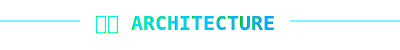

# <div align='center'>


<br/>

<b>NEON SENTINEL</b> · Computer‑Vision Security System<br/>
<sub>YOLOv8 · MediaPipe Pose · Face Recognition · Multi‑Zone Breach Detection · Telegram Control</sub>

<br/>


</div>

<br/>

<div align='center'>
  
</div>

<br/>

<div align='center'>
  
</div>

## Overview

**Neon Sentinel** is a desktop security system that turns a standard webcam into a **vision‑driven intrusion detection console**.
It combines:

- **YOLOv8 person detection** for robust human detection
- **MediaPipe pose skeletons** for partial‑body and foot‑position awareness
- **Multi‑zone 3D breach logic** with animated holographic zones
- **Face recognition** for trusted users
- **Motion heat maps** to visualize movement over time
- **Telegram bot control panel** for remote arming, snapshots, logs, and stats
- **Neon PyQt6 GUI** styled as a futuristic security operations dashboard

> All processing runs locally. No telemetry is sent anywhere except explicitly via your configured Telegram bot.

<br/>

<table>
  <tr>
    <td align='center' width='50%'>
      
    </td>
    <td width='50%' valign='top'>

### Core Capabilities

- Real‑time **multi‑zone breach detection** with animated holographic grids
- **Partial skeleton detection** (hands, feet, torso) to reduce false negatives
- **Trusted face whitelist** with automatic database building
- **Motion heat map** overlay with temporal decay
- **Continuous alarm** with mute, TTS alerts, and auto‑recording
- **Camera or video file** input with transport controls
- **SQLite analytics** for events and daily stats

    </td>
  </tr>
</table>

<br/>

<div align='center'>
  
</div>

## Full Feature List

<table>
  <tr>
    <td align='center' width='33%'>
      
      <br/>
      <b>Vision Engine</b>
    </td>
    <td align='center' width='33%'>
      
      <br/>
      <b>Zone Intelligence</b>
    </td>
    <td align='center' width='33%'>
      
      <br/>
      <b>Remote Control</b>
    </td>
  </tr>
  <tr>
    <td valign='top'>

- YOLOv8 person detection
- Configurable sensitivity (Low / Medium / High)
- MediaPipe pose skeletons
- Partial body detection (hands, feet, torso, arms, legs)
- Per‑frame heat‑map motion detection

    </td>
    <td valign='top'>

- Multiple named detection zones
- 3D‑style zone walls and scan lines
- Auto‑detect floor corners
- Zone optimization via convex hull
- Per‑zone breach visualization and labels

    </td>
    <td valign='top'>

- Telegram inline keyboard control
- Arm / disarm, record / stop, mute / unmute
- Live snapshots with photo delivery
- Status, stats, and recent event logs
- Remote sensitivity & night‑mode toggling

    </td>
  </tr>
</table>

<br/>

<table>
  <tr>
    <td align='center' width='33%'>
      
      <br/>
      <b>Identity Layer</b>
    </td>
    <td align='center' width='33%'>
      
      <br/>
      <b>Alerting Layer</b>
    </td>
    <td align='center' width='33%'>
      
      <br/>
      <b>UI & Analytics</b>
    </td>
  </tr>
  <tr>
    <td valign='top'>

- Face recognition via `face_recognition`
- Auto‑processing of new faces from `trusted_faces/`
- Persistent encoded faces in `fixed_images/`
- Trusted faces can suppress alarms
- Spoken greetings via TTS

    </td>
    <td valign='top'>

- Continuous alarm with configurable frequency
- Auto‑recording when breach is detected
- Snapshot capture on every alert
- Telegram alerts with embedded snapshots
- Daily stats (detections, breaches, alerts)

    </td>
    <td valign='top'>

- Neon PyQt6 desktop UI
- Camera and video‑file modes
- Night‑vision and heat‑map overlays
- Zone editor with drawing tools
- Status, breach, and face database panels

    </td>
  </tr>
</table>

<br/>

<div align='center'>
  
</div>

<br/>

<div align='center'>
  
</div>

## How the System Works

<div align='center'>
  
</div>

### Processing Pipeline

1. **Capture Layer**
   - `CameraThread` pulls frames from a webcam
   - `VideoThread` can replay recorded files for analysis

2. **Detection Layer**
   - `PersonDetector` (YOLOv8 + MediaPipe Pose)
     - Robust **person bounding boxes**
     - **Skeleton landmarks** for fine‑grained contact points
     - **Partial body detection** when the full body is not visible
   - `MotionDetector`
     - Frame differencing and adaptive thresholding
     - Persistent **heat map** of motion with temporal decay

3. **Zone Intelligence**
   - `MultiZoneManager` manages multiple `DetectionZone3D` objects
   - Each zone renders:
     - Neon polygon outline and animated grid
     - 3D‑style walls, scan beam, and label
   - Breach detection checks:
     - Person box corners and feet
     - Skeleton landmarks
     - Partial body boxes
     - Motion regions intersecting zones

4. **Identity & Policy Layer**
   - `FaceRecognitionEngine`
     - Builds a local face encoding database from `fixed_images/`
     - Auto‑promotes valid images from `trusted_faces/`
   - Trusted faces:
     - Can suppress alarms
     - Receive TTS greetings and tags in the UI

5. **Alerting & Control Layer**
   - `TelegramBot` exposes a **control panel**:
     - Arm / Disarm, Record, Snapshot, Mute, Stats, Logs
   - `ContinuousAlarm` handles continuous beeping with mute support
   - `TTSEngine` issues spoken messages for events
   - `DatabaseManager` logs events and aggregates daily stats

6. **Presentation Layer**
   - `SecuritySystemWindow` (PyQt6):
     - Neon video viewport with overlays
     - Interactive zone drawing
     - Status bar, stats widgets, and controls

<br/>

<div align='center'>
  
</div>

## Installation Guide

> Recommended: **Python 3.10+** with a virtual environment.

### 1. Clone the repository

```bash
git clone https://github.com/Binivert/Security-System.git
cd Security-System
```

### 2. Create and activate a virtual environment (recommended)

```bash
python -m venv .venv

# Windows
.venv\\Scripts\\activate

# Linux / macOS
source .venv/bin/activate
```

### 3. Install dependencies

```bash
pip install --upgrade pip
pip install -r requirements.txt

# Additional heavy dependencies (if not already installed)
pip install ultralytics mediapipe face-recognition dlib
```

> The first YOLOv8 run will download the `yolov8n.pt` weights automatically.

### 4. Configure Telegram (optional but recommended)

1. Create a bot via **@BotFather** and get a **bot token**.
2. Get your **chat ID** (e.g. by messaging @userinfobot).
3. Edit `config.py` and set:

```python
TELEGRAM_BOT_TOKEN = 'YOUR_BOT_TOKEN_HERE'
TELEGRAM_CHAT_ID = 'YOUR_CHAT_ID_HERE'
```

Keep these values **secret**; do not commit real tokens to a public repository.

### 5. Run the application

```bash
python main.py
```

The PyQt6 dashboard will open, connect to your default camera, and start processing.

<br/>

<div align='center'>
  
</div>

## Usage Guide

### 1. Basic Workflow

1. **Start the app** with `python main.py`.
2. Ensure your camera feed is visible.
3. Draw one or more **zones** and then **ARM** the system.
4. Monitor breaches, alerts, snapshots, and logs either on the desktop UI or via Telegram.

### 2. Drawing & Managing Zones

- Click **"➕ New"** to create a new zone.
- Enable **"✏️ Draw"** and click points on the video widget to define the polygon.
- Click **"🔧 Optimize"** to auto‑optimize to a convex hull.
- Use **"🤖 Auto‑Detect"** to detect approximate floor corners.
- Click **"🗑️ Clear"** to remove all zones.

Zones support animated 3D walls, scan lines, and labels. Any person, skeleton landmark, or partial body crossing a zone triggers a breach when the system is armed.

### 3. Arming, Recording, Snapshots

- **Arm / Disarm**
  - Press **"🔒 ARM SYSTEM"** to arm.
  - Press again (**"🔓 DISARM"**) to disarm.
- **Recording**
  - Toggle **"⏺ Record"** (records to `recordings/`).
  - Auto‑recording can be enabled via **"📹 Auto‑Record"**.
- **Snapshots**
  - Press **"📸 Snap"** to store a high‑quality frame in `snapshots/`.

### 4. Visual Overlays

- **Night Vision**: boosts brightness and tints frames for low light.
- **Motion Heat Map**: overlays a decaying heat map of motion intensity.
- **Status HUD**: shows FPS, detector availability, person count, and source type.

### 5. Telegram Bot Controls

All commands can be issued via the inline keyboard or chat commands:

- `arm` / `disarm`
- `snap` / `snapshot`
- `record` / `stoprecord`
- `mute` / `unmute`
- `status` – current system status
- `stats` – daily statistics
- `log` – recent events
- `reload_faces` – reload trusted faces
- `nightmode on|off`
- `sensitivity low|medium|high`

The bot sends alerts with snapshots when breaches occur, as well as recovery messages when zones are cleared.

<br/>

<div align='center'>
  
</div>

## File Structure

Only **production‑relevant files** required to run `main.py` are listed.
Experimental / legacy folders are intentionally excluded.

```bash
Security-System/
├─ main.py                     # Application entrypoint
├─ config.py                   # Global configuration (paths, thresholds, Telegram, etc.)
├─ gui.py                      # PyQt6 neon GUI (SecuritySystemWindow)
├─ detectors.py                # YOLOv8 + MediaPipe + motion detection engine
├─ utils.py                    # Detection zones, zone manager, corner detection
├─ telegram_bot.py             # Telegram bot (inline keyboard + commands)
├─ audio.py                    # TTS engine and continuous alarm
├─ database.py                 # SQLite schema + daily stats and event log helpers
├─ requirements.txt            # Python dependencies for the core system
├─ README.md                   # This futuristic dashboard README
└─ readme_assets/              # Cyberpunk SVG assets for the README
   ├─ header-security-system.svg
   ├─ divider-glitch.svg
   ├─ header-overview.svg
   ├─ header-features.svg
   ├─ header-architecture.svg
   ├─ header-installation.svg
   ├─ header-usage.svg
   ├─ header-structure.svg
   ├─ header-required-files.svg
   ├─ header-demo.svg
   ├─ header-widgets.svg
   ├─ header-license.svg
   ├─ icon-yolo.svg
   ├─ icon-zones.svg
   ├─ icon-telegram.svg
   ├─ icon-face-recognition.svg
   ├─ icon-motion.svg
   ├─ flow-security-pipeline.svg
   ├─ panel-system-status.svg
   ├─ panel-demo-screenshot.svg
   ├─ panel-demo-video.svg
   ├─ layout-1col.svg
   ├─ layout-2col.svg
   ├─ layout-mixed.svg
   ├─ arrow-glow.svg
   ├─ frame-neon.svg
   └─ corner-accent.svg
```

> Runtime folders like `recordings/`, `snapshots/`, `alerts/`, `trusted_faces/`, `fixed_images/`, and the `security.db` database are created automatically at runtime based on `config.Config`.

<br/>

<div align='center'>
  
</div>

## Required Files to Upload to GitHub

### 1. Source Code

Upload these **Python modules**:

- `main.py`
- `config.py` (without hard‑coded secrets in public repos)
- `gui.py`
- `detectors.py`
- `utils.py`
- `telegram_bot.py`
- `audio.py`
- `database.py`

### 2. Assets & Configuration

- `requirements.txt`
- `README.md` (this file)
- `readme_assets/` (all SVGs used by the README)
- Optional but recommended:
  - `.gitignore`
  - `LICENSE` (AGPL‑3.0)
  - `.env.example` or configuration template if you externalize secrets

### 3. Documentation

- Any additional Markdown docs, design notes, or architecture diagrams
  (e.g. `docs/` if you maintain extended docs).

### 4. Explicitly Exclude (Do **not** commit)

- Python virtual environments
  - `.venv/`, `venv/`, or similar
- Bytecode and cache directories
  - `__pycache__/`, `*.pyc`, `*.pyo`
- IDE or editor metadata
  - `.idea/`, `.vscode/`, `.DS_Store`, `Thumbs.db`
- Runtime and generated artifacts
  - `recordings/`, `snapshots/`, `alerts/`
  - `trusted_faces/` and `fixed_images/` containing personal images
  - `security.db` (SQLite database)
- Temporary or experimental folders you no longer use
- Any `.aye/` or local tooling folders

This keeps the repo lean, reproducible, and free from personal data.

<br/>

<div align='center'>
  
</div>

## Demo Section

> This section is intentionally designed as a **visual placeholder** so you can drop in real screenshots and videos later.

<table>
  <tr>
    <td align='center' width='50%'>
      
      <br/>
      <b>Live GUI Screenshot</b>
      <br/>
      <sub>Replace this panel with a real screenshot of the neon PyQt dashboard.</sub>
    </td>
    <td align='center' width='50%'>
      
      <br/>
      <b>Demo Video / GIF</b>
      <br/>
      <sub>Embed a short demo video or animated GIF showcasing detection and breaches.</sub>
    </td>
  </tr>
</table>

Example embeds (once you have media):

```markdown


https://github.com/user/repo/assets/your-demo-video-id
```

<br/>

<div align='center'>
  
</div>

## GitHub Widgets · Analytics Deck

> These widgets are visually framed by neon SVG dividers to match the project aesthetic.

<div align='center'>
  
</div>

<br/>

<div align='center'>

<table>
  <tr>
    <td width='60%'>
      
      <br/>
      
    </td>
    <td width='40%'>
      
      <br/>
      
      <br/>
      
    </td>
  </tr>
</table>

<br/>


<br/>

<table>
  <tr>
    <td width='100%'>
      
      <br/>
      
    </td>
  </tr>
</table>

</div>

You can freely adjust the `username` and theming parameters to match your profile and desired color palette.

<br/>

<div align='center'>
  
</div>

## License · AGPL-3.0

This project is licensed under the **GNU Affero General Public License v3.0 (AGPL‑3.0)**.

- You are free to **use, modify, and distribute** this software.
- If you modify and **run it as a network service**, you must make your source code (including modifications) available to users of that service.
- Any derivative work that you distribute must remain under **AGPL‑3.0**.

> Add a `LICENSE` file to the repository containing the full AGPL‑3.0 text to make the licensing explicit.

---

<div align='center'>
  
  <br/>
  <sub>Neon Sentinel · Vision‑driven security for the cyberpunk era.</sub>
</div>
